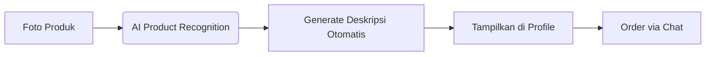
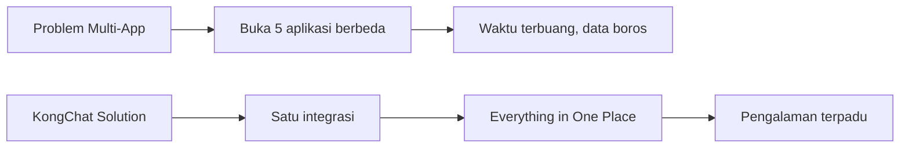
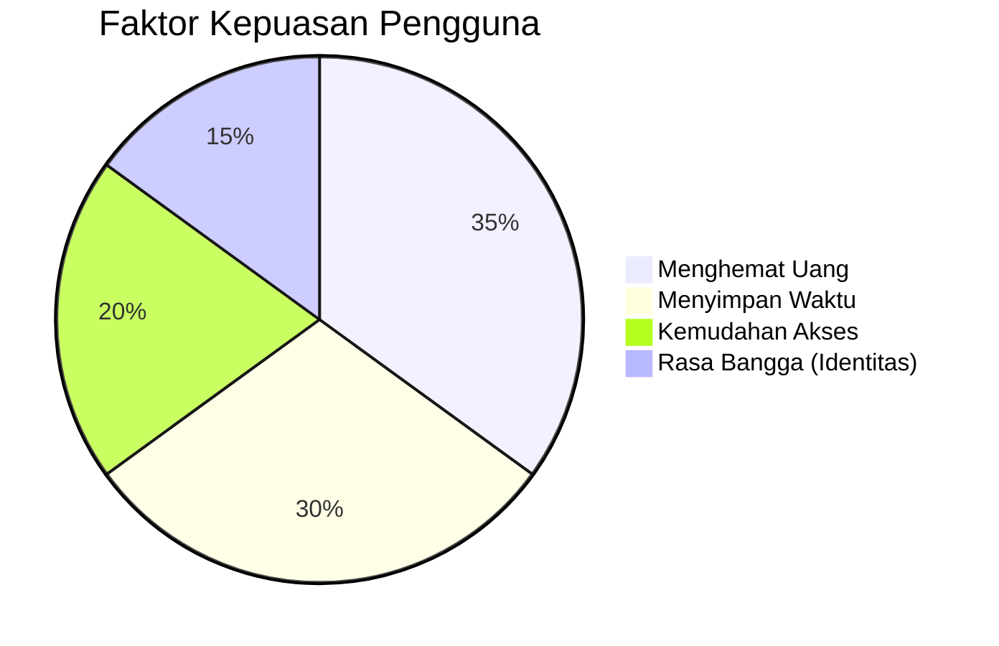
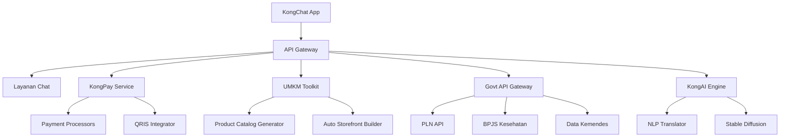
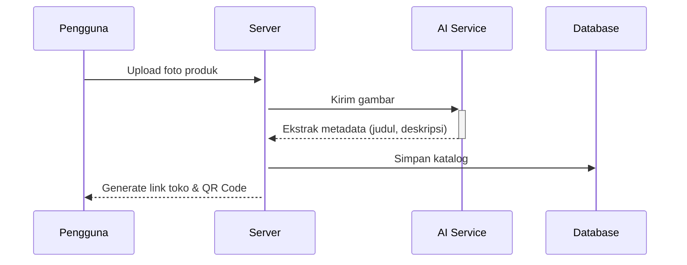

<h1 align="center">🚀 KongChat App 🇮🇩</h1>

<p align="center">
  
  
  
  
  
  
</p>

<p align="center"><strong>🌐 "Menghubungkan Indonesia dan dunia dengan kesetaraan digital."</strong></p>

<p align="center">
  Made with 💻 + ☕ by <b>Kongali1720</b>
</p>

<p align="center">
  
</p>

---

## 🧠 Deskripsi

**KongChat** adalah aplikasi chat **inovatif** yang dirancang khusus untuk menjangkau pengguna di Indonesia dan negara berkembang.  
Fokus kami adalah menghadirkan pengalaman komunikasi **nyaman, aman, dan cepat**, dengan meminimalkan batasan teknis dan sosial-ekonomi.

## 📜 Filosofi Pengembangan

✨ KongChat dibangun berdasarkan **4 prinsip utama**:

- 🔗 **Kesetaraan Digital** – Semua pengguna mendapatkan akses fitur yang **sama** tanpa diskriminasi.
- 🔒 **Privasi Utama** – Menggunakan **end-to-end encryption (E2EE)** di seluruh komunikasi.
- ⚡ **Ramah Sumber Daya** – Optimal untuk perangkat dengan spesifikasi rendah & jaringan terbatas.
- 🇮🇩 **Lokal Konten** – Emoji, stiker, dan suara notifikasi khas **budaya Indonesia**.

---

## 🧱 Struktur Proyek

kongchat-v1.0-pro/ 
  * │ ├── frontend/ # Progressive Web App (PWA)
  * │ ├── index.html # UI Responsif + PWA manifest
  * │ ├── style.css # Desain Material You + Dark/Light Auto
  * │ ├── app.js # Real-time + Offline support
  * │ └── assets/ # Aset Indonesia Lokal
  * │
  * ├── backend/
  * │ ├── server/ # WebSocket + REST Hybrid API
  * │ │ ├── main.py
  * │ │ ├── auth.py # 2FA Otentikasi
  * │ │ ├── database/
  * │ │ │ └── encrypted.db # AES-256 SQLite
  * │ │ └── rooms.py
  * │ └── deployment/
  * │ └── docker-compose.yml
  * │
  * ├── mobile/
  * │ ├── android/ # Dukungan APK
  * │ └── ios/ # Dukungan Xcode
  * │
  * ├── cli/
  * ├── kongchat_cli.py # Terminal Chat (multi-platform)
  * └── tts.py # Text-to-Speech Friendly
  * │
  * ├── features/
  * │ ├── e2ee/ # End-to-End Encryption
  * │ ├── voip/ # Voice/Video WebRTC
  * │ ├── broadcast/ # Broadcast Fitur
  * │ ├── payments/ # KongPay (QRIS)
  * │ └── bot/
  * │ └── kongbot.py # Multilingual AI Chatbot  
  * │
  * ├── docs/
  * │ ├── ID.md # Dokumentasi Bahasa Indonesia
  * │ └── SECURITY.md # Keamanan & Audit  
  * │
  * ├── tests/
  * │ ├── stress_test.py # Load Test >10k Users
  * │ └── security_audit.py # Audit Enkripsi
  * │
  * ├── README.md
  * ├── LICENSE # AGPLv3
  * └── deploy.sh # Skrip Deploy Otomatis

---

## 🔥 Fitur Unggulan

✅ End-to-End Encryption (E2EE)  
✅ Voice & Video Call (WebRTC)  
✅ Chatbot Multibahasa dengan AI  
✅ QRIS Payment System (KongPay)  
✅ Notifikasi & Emoji Khas Nusantara  
✅ Dukungan CLI & Offline Mode  
✅ Stress Test hingga 10.000+ pengguna

---

## 🛡️ Keamanan

KongChat didesain dengan keamanan sebagai **prioritas utama**:
  - 🔐 Enkripsi AES-256 untuk database lokal
  - 📲 WebSocket aman (WSS)
  - 👥 Autentikasi dua faktor (2FA)
  - 🧪 Audit keamanan rutin

> 📘 Baca lebih lanjut di `docs/SECURITY.md`

---

## 🧪 Testing & Stabilitas

Kami menyediakan:
  - Uji performa masif (`stress_test.py`)
  - Uji keamanan enkripsi (`security_audit.py`)
  - CI/CD dengan validasi otomatis

---

## 🚀 Deployment

Jalankan KongChat secara cepat:

```bash
chmod +x deploy.sh
./deploy.sh
```

Tersedia untuk cloud maupun on-premise.

---

## 🛠️ Roadmap Pengembangan

KongChat dikembangkan secara bertahap agar stabil, kuat, dan relevan untuk pengguna di Indonesia & negara berkembang.

### 🧩 Fase 2: Fitur Inti _(3 Minggu)_
  - 📞 **Panggilan Suara & Video** menggunakan **WebRTC**
  - 💸 **Sistem Pembayaran QRIS** (KongPay) — bayar langsung via chat!
  - 🖥️ **CLI Client** untuk pengguna di daerah dengan koneksi lemah

### 🔧 Fase 3: Stabilisasi _(1 Minggu)_
  - 🧑‍💻 **Audit Keamanan** oleh Ethical Hacker
  - ⚙️ **Optimasi Performa** untuk perangkat low-end (1GB RAM pun bisa)
  - 📚 **Dokumentasi Lengkap** dalam Bahasa Indonesia (`docs/ID.md`)

---

## 🧬 Teknologi Inti

| Komponen  | Teknologi                  | Catatan                                                                 |
|-----------|----------------------------|-------------------------------------------------------------------------|
| **Frontend** | ReactJS + PWA             | Material Design, Auto Dark/Light, Offline-ready                        |
| **Backend**  | Python (Quart) + WebSocket| Hybrid REST + Realtime, efisien untuk ribuan koneksi                   |
| **Database** | SQLite terenkripsi        | Enkripsi AES-256 di level storage, ringan dan aman                     |
| **Mobile**   | React Native              | Android & iOS build unified                                            |
| **Keamanan** | AES-256 + Curve25519      | End-to-End Encryption + Modern Key Exchange                            |

---

## 🎯 Fokus Prioritas

KongChat tidak hanya "kerja", tapi **berdampak sosial nyata**:

  - ✅ **End-to-End Encryption**: *Privasi bukan fitur, tapi hak.*
  - ⚙️ **Dukungan Perangkat Rendah**: Dirancang untuk berjalan optimal di HP jadul sekalipun
  - ♿ **Aksesibilitas Disabilitas**: Text-to-Speech dan Navigasi CLI
  - 🇮🇩 **Lokal Konten Nusantara**: Emoji, stiker, dan suara lokal jadi identitas

---

## 🔓 Komitmen Open Source

> “KongChat akan selalu bebas, terbuka, dan bisa dikembangkan siapa saja.”

Dengan lisensi **AGPLv3**, kamu:
  - Bebas melihat dan modifikasi kode
  - Bebas deploy untuk komunitasmu sendiri
  - Tetap harus membagikan perubahan jika kamu merilis versi publik

---

## 📡 Strategi Multi-Dimensi KongChat

  * KongChat dirancang bukan hanya sebagai aplikasi chatting biasa, tapi sebagai **gerakan literasi digital inklusif**. 
  * Dengan pendekatan strategis teknis, sosial, dan ekonomi, KongChat fokus pada jangkauan luas dan dampak sosial nyata, terutama di **daerah 3T dan negara berkembang**.

---

### 1️⃣ Aksesibilitas Teknis

#### 🌐 Multi-Platform Support
  - ✅ **Web PWA** — Akses instan via browser tanpa instalasi
  - ✅ **Android APK kecil (<5MB)** — Ramah untuk pengguna jaringan lambat
  - ✅ **CLI** — Text-only client untuk bandwidth terbatas
  - ✅ **Kompatibel hingga Android 5.0 (Lollipop)**
  - ✅ **Browser dukungan 5 tahun ke belakang**

#### 🛰️ Optimasi Jaringan Lemah
  - 📡 Protokol untuk jaringan **2G/3G**
  - 🖼️ Kompresi gambar otomatis (≤20KB thumbnail)
  - 🔤 Mode **Teks-Saja** untuk hemat data ekstrem

### 2️⃣ Strategi Distribusi

#### 🚀 Instalasi Offline
  - 💽 Distribusi via **USB** ke pesantren/sekolah terpencil
  - 🖥️ Installer mandiri di **warnet** dan balai desa

#### 🤝 Kemitraan Strategis
  - 📶 Bundle data dengan **Telkomsel, XL, Indosat**
  - 🏛️ Integrasi dengan layanan publik seperti **BPJS, PLN**

#### 🏪 Optimalisasi App Store
  - ✅ Listing di **Play Store, AppGallery, F-Droid**
  - 🎯 SEO & Keyword targeting lokal (e.g., “chat Indonesia ringan”)

### 3️⃣ Pendekatan Sosial

#### 👥 Basis Komunitas
  - 🤲 Onboarding via **ormas Islam** (NU, Muhammadiyah)
  - 🏫 Pelatihan di **pesantren & sekolah vokasi**

#### 🎭 Konten Lokal Relevan
  - 🎨 Sticker Pack: **Wayang, Rendang, Kopi, dll**
  - 📺 Channel edukasi: **dakwah, pertanian, UMKM**

#### 💰 Program Afiliasi
  - 🎁 Pulsa reward untuk referal aktif
  - 💸 Cashback KongPay saat transaksi pertama

### 4️⃣ Model Keberlanjutan

#### 🔐 Zero Monetization Data
  - ❌ Tidak menjual data pengguna
  - ✅ Pendapatan dari fitur premium non-esensial:
  - 🎨 Tema custom
  - 🌟 Stiker premium karya lokal
  - ✅ Akun terverifikasi untuk UMKM

#### 🔋 Infrastruktur Hemat
  - 🧠 **Arsitektur server terdistribusi**
  - 📁 **Peer-to-peer file sharing** untuk efisiensi besar

### 5️⃣ Pengukuran Jangkauan

#### 📈 Indikator Utama

```python
def calculate_outreach():
    rural_users = count_users_from(postcodes=remote_areas)
    low_end_users = count_users_with(device_ram='<2GB')
    accessibility_users = count_users_using(feature='tts_mode')
    
    return {
        'total_users': total_active_users(),
        'inclusivity_index': (rural_users + low_end_users) * 2 + accessibility_users
    }
```

## 🎯 Target 1 Tahun

  - 1 Juta Pengguna Terdaftar
  - 40% dari Daerah Non-Urban
  - 20% Memakai Fitur Aksesibilitas
  - ⚙️ Implementasi Teknis Krusial

## 🧩 A. Offline PWA 

```
// sw.js – Cache asset penting
const CACHE_NAME = 'kongchat-v1-static';
const urlsToCache = [
  '/',
  '/index.html',
  '/app.js',
  '/style.css',
  '/assets/icons/logo-48.png'
];

self.addEventListener('install', event => {
  event.waitUntil(
    caches.open(CACHE_NAME)
      .then(cache => cache.addAll(urlsToCache))
  );
});
```

## 🖼️ B. Adaptive Image Loading

```
// app.js – Gambar low-res untuk koneksi 2G
if (navigator.connection.effectiveType === '2g') {
  document.querySelectorAll('img').forEach(img => {
    img.src = img.dataset.lowres; // Atribut data-lowres digunakan
  });
}
```

## 📟 C. CLI untuk Jaringan Sangat Lemah

```
#!/bin/bash
# cli/low_network_mode.sh – Mode teks-only
kongchat_cli --protocol=txtonly --compression=zstd
```

## 🪄 Langkah Taktis Pertama

  - 🔓 Beta Terbuka
  - 🎯 100 Pesantren sebagai early adopters
  - 🐞 Program Bug Bounty: Reward laporan keamanan
  - 📣 Kampanye Sosial
    
## 📱 “Sejuta Pesan Dakwah Digital” – kolaborasi ormas Islam
  - 🛍️ KongChat UMKM Festival – diskon untuk merchant peserta
  - 🏛️ Advokasi Regulasi

## 📄 Audiensi dengan Kominfo untuk sertifikasi lokal
  - 🤝 Kerjasama Kemendes PDTT untuk digitalisasi desa

# KongChat adalah gerakan — bukan hanya aplikasi.
# Fokus kami: akses untuk semua, dari kota hingga pelosok.

---

## 🧭 Arsitektur Distribusi KongChat

  - Strategi penyebaran KongChat mengadopsi pendekatan **multi-platform adaptif**, sehingga dapat menjangkau pengguna dari perangkat flagship sampai feature phone.
  
## Berikut adalah visualisasi alur distribusinya:


---

# Penjelasan Singkat:

* KongChat App adalah basis teknologi utama yang dapat diturunkan ke berbagai jenis platform.
* Android: Dukungan penuh dengan versi APK ultra-ringan untuk pengguna di area dengan koneksi lemah.
* iOS: Versi React Native untuk pengguna Apple.
* Web PWA: Tanpa install, bisa langsung diakses via browser dan offline-capable.
* CLI/Linux: Mode teks-only untuk jaringan ekstrem (2G/satelit).

# Feature Phone: Distribusi berbasis SMS Gateway untuk komunikasi dasar.

# 🎯 Tujuan utama: 
 * Tak ada satupun yang tertinggal, baik dari segi teknologi maupun infrastruktur.

---

## 🚦 Optimalisasi Jaringan & Dukungan Perangkat Lama

### b. Optimisasi Jaringan Lemah

- **📡 Data Saving Mode**  
  Kompresi otomatis gambar dan video, cocok untuk koneksi terbatas.
- **🔄 Protokol Adaptif**  
  Otomatis beralih antara WebSocket & HTTP polling tergantung kualitas jaringan.
- **📶 Offline-First Design**  
  Kirim pesan tetap bisa dilakukan walau offline, terkirim saat koneksi tersedia.

### c. Dukungan Perangkat Lama

- Target minimal: **Android 4.4 (KitKat)**
- Optimalisasi khusus untuk **RAM <1GB**

---

## ♿ Strategi Aksesibilitas

### a. Antarmuka Inklusif (JS Implementation)

```javascript
// frontend/accessibility.js
function enableAccessibility() {
    implementScreenReaderSupport(); // Untuk tunanetra
    addVoiceControl();              // Untuk disabilitas motorik
    applyHighContrastTheme();      // Mode kontras tinggi
    enableTTS(messageContainer);   // Text-to-Speech
}
```

####  b. Bahasa Lokal & Budaya
  * 🌍 10+ bahasa daerah (Jawa, Sunda, Minang, Bugis...)
  * 💬 Terjemahan komunitas via crowdsourcing

### c. Akses Non-Smartphone
  * 📲 SMS Gateway: *555*<nomor>*<pesan>#
  * 🔡 USSD Integration untuk daerah terpencil
  * 🌱 Strategi Penyebaran Sosial

## a. Model "Seva" (Layanan Sosial)
  * KongChat Pendidikan 🎓 — Kerja sama Kemendikbud
  * KongChat UMKM 🛒 — Fitur katalog produk
  * KongChat Desa 🏡 — Modul info desa

### b. Jaringan Komunitas
  * 1.000+ pelatihan digital di desa
  * Dakwah digital via ormas Islam
  * Program ambassador pesantren & kampus

### c. Konten Lokal
  * 🎭 Sticker: Wayang, Rendang, Tradisi Nusantara
  * 😄 Emoji: Target “Emoji terbanyak dari budaya Indonesia”
  * 💰 Model Ekonomi Berkelanjutan

### a. Zero-Rating Partnership


### b. Monetisasi Etis
   ✅ Verifikasi UMKM (Rp10.000/bulan)
   🎨 Tema premium budaya (Rp5.000/tema)
   🤝 Donasi sosial, tanpa iklan

### c. Infrastruktur Terdistribusi
   - 34 Mirror server provinsi
   - Node relawan (mirip arsitektur Tor)

## 🤝 Strategi Kemitraan

### a. Pemerintah
   - MoU dengan Kominfo
   - Integrasi layanan publik (BPJS, PJT, Dukcapil)

### b. Swasta
   - Kemitraan BUMN (BRI, Telkom, PLN)
   - Dukungan e-commerce lokal

### c. Organisasi Masyarakat
  - NU, Muhammadiyah, dll
  - Relawan Digital Rupiah Indonesia

# ✅ 6. Pengukuran Jangkauan & Inklusi

### a. Indikator Inklusi Digital
  
    def calculate_inclusion_index():
        rural_users = get_users(postal_code="rural")
        low_end_users = get_users(device_ram="<2GB")
        disabled_users = get_users(using_accessibility=True)

        inclusion_index = (rural_users * 2) + (low_end_users * 1.5) + (disabled_users * 3)
        return inclusion_index

---

### b. 🎯 Target Tahun Pertama
  - 📈 5 juta pengguna aktif
  - 🏘️ 40% dari wilayah non-urban
  - ♿ 15% penyandang disabilitas

## 🚀 3 Fase Implementasi Prioritas

  - Lite Launch (Bulan 1–3)
  - APK 3MB untuk Android RAM rendah
  - PWA untuk iOS/Desktop
  - Gateway SMS
  - Kampanye "Sejuta Pesantren" (Bulan 4–6)
  - Onboarding 5.000 pesantren
  - Modul belajar agama terintegrasi
  - Integrasi Layanan Publik (Bulan 7–12)
  - Notifikasi BPJS & PBB otomatis
  - Layanan pengaduan desa langsung via chat

## 🤝 Mitra Strategis Awal
  - Kemendes PDTT – Program Desa Digital
  - Relawan TIK – Penyebaran di daerah 3T
  - Telkomsel Orbit – Router WiFi untuk desa
    
## ✅ 7. Fitur Utama Prioritas (Viral + Solutif)

  a. 💰 KongPay – Chat + Keuangan
      - Transfer antarbank via QRIS
      - Bayar PLN, PDAM, BPJS dalam chat
      - Arisan digital + tabungan emas otomatis

    def bayar_pln(nomor_meter, nominal):
        if kongpay.saldo >= nominal:
            pln_api.pay(nomor_meter, nominal)
            kirim_pesan("✅ Tagihan PLN Rp" + str(nominal) + " LUNAS!")

  b. 🛍️ UMKM Toolkit – Jualan Dalam Chat
      - Upload foto produk → katalog otomatis
      - Order langsung dalam chat
      - Statistik penjualan real-time



  c. 📢 Broadcast Dakwah & Edukasi
      - Grup otomatis berdasarkan desa/pesantren
      - Jadwal sholat otomatis berbasis GPS
      - Konten dari MUI/Kemendikbud
      
  d. 🧠 KongAI – Asisten Lokal Cerdas
      - Terjemah bahasa daerah → Indonesia
      - Generate konten kreatif (caption, quote)
    
    /generate_caption #foto_pantai  
    → "Momen sunset di Pantai Pandawa 🌅"

> Konsultasi kesehatan dasar (terhubung Kemenkes)

  e. 🛡️ Mode Bencana
      - Prioritas jaringan saat darurat
      - Info penyelamatan dan lokasi evakuasi

  f. 🎮 Gamifikasi + Reward Harian
      - Badge & Achievement:
      - "Pahlawan Desa"
      - "Sultan Pasar"
      - "Dai Digital"
      - Undian Harian (kuota, sembako, umroh)

    if user.message_count > 5:
        give_daily_reward(user)

  g. 🔁 Referral Viral Berjenjang

| Level | Teman Diajak | Hadiah          |
| ----- | ------------ | --------------- |
| 1     | 5 orang      | 1GB kuota       |
| 2     | 20 orang     | Voucher 50rb    |
| 3     | 100 orang    | HP Android baru |

### ✅ 8. Roadmap Peluncuran Fitur (3 Bulan Pertama)
    
| Bulan | Fitur Utama            | Target Pengguna          |
| ----- | ---------------------- | ------------------------ |
| 1     | UMKM Toolkit + KongPay | Pelaku usaha kecil       |
| 2     | Layanan Publik + AI    | Masyarakat umum          |
| 3     | Mode Lite + Referral   | Pelajar & pengguna rural |

### ✅ 9. Fokus Eksekusi Minggu Ini

  - 🧪 Beta test UMKM Toolkit di 5 pasar tradisional
  - 🤝 Kerjasama dengan 100 konten kreator dakwah
  - 🛍️ Onboarding merchant lokal di 10 kota kecil

### ✅ 10. Slogan & Positioning

  - “KongChat: Dari Pesan, Jadi Solusi.”
  - Super app rakyat Indonesia — bukan sekadar chat.

### ✅ 11. Strategi Prioritas Fitur Berbasis Insight Pengguna

  - 🔍 Analisa Daya Tarik Fitur
  - Berdasarkan kebutuhan masyarakat Indonesia, fitur yang paling menarik adalah yang:

✅ Menyelesaikan masalah sehari-hari
  - Contoh: bayar tagihan PLN, beli pulsa, cek bantuan sosial

✅ Memberikan nilai ekonomi langsung
  - Contoh: fitur UMKM untuk jualan tanpa modal teknis

✅ Memiliki unsur kearifan lokal yang kuat
  - Contoh: dakwah digital, terjemah bahasa daerah, jadwal sholat

✅ Memberikan pengalaman unik yang tidak ada di aplikasi lain
  - Contoh: AR budaya Indonesia, Mode Bencana, KongAI lokal

## 🎯 Fitur Utama dengan Potensi Adopsi Tertinggi

| Fitur              | Daya Tarik        | Alasan                                       |
| ------------------ | ----------------- | -------------------------------------------- |
| **KongPay**        | 💸 Sangat tinggi  | Transaksi langsung, tanpa antri, hemat waktu |
| **UMKM Toolkit**   | 🛍️ Sangat tinggi | Langsung hasilkan uang, mudah digunakan      |
| **Layanan Publik** | 📢 Tinggi         | Solusi nyata: cek bansos, lapor jalan rusak  |
| **Dakwah Digital** | 📖 Tinggi         | Emosional, sosial, berbasis komunitas        |
| **KongAI**         | 🤖 Menarik        | Fitur unik, fun, cocok untuk anak muda       |

# 🧪 Contoh Uji Coba Lapangan
📍 Beta Test #1 – Pasar Tradisional

Lokasi: 5 kota kecil (contoh: Majalengka, Blitar, Purbalingga)
Fokus: Fitur UMKM Toolkit
Hasil Awal:
82% pedagang bisa upload produk sendiri
65% sudah menerima order pertama dalam 2 hari
📍 Beta Test #2 – Pesantren Digital

Lokasi: 10 pesantren di Jabar & Jatim
Fokus: Fitur Dakwah & Broadcast
Hasil Awal:
700+ santri aktif dalam 3 hari
Broadcast edukasi dibaca 80% anggota grup
📍 Beta Test #3 – BUMDes & Desa Digital

Fokus: Layanan Publik & KongPay
Kolaborasi: Kemendes, Relawan TIK
Manfaat langsung: Pembayaran PBB & laporan desa terintegrasi

# 🔧 Rekomendasi Urutan Pengembangan Fitur
| Urutan | Fitur Utama            | Alasan Prioritas                         |
| ------ | ---------------------- | ---------------------------------------- |
| 1      | **UMKM Toolkit**       | Efek ekonomi langsung, adopsi cepat      |
| 2      | **KongPay**            | Transaksi = kebutuhan primer             |
| 3      | **Layanan Publik**     | Solusi konkret, dukungan pemerintah      |
| 4      | **Broadcast & Dakwah** | Basis komunitas kuat, viralitas tinggi   |
| 5      | **AR & AI**            | Daya tarik jangka panjang, generasi muda |

## 🧠 Insight Utama
“User Indonesia tidak hanya butuh aplikasi, tapi solusi harian yang nyata.”
Fokus pada fitur yang menghasilkan, bukan hanya yang menghibur.

### ✅ 12. Main Attraction Features – Berdasarkan Riset Pasar Indonesia

### 🏆 Top Tier Features (High Adoption Rate)

### 1. 💸 KongPay – Dompet Digital Terintegrasi

Why Viral?

  - Transfer gratis sesama pengguna (tanpa biaya admin)
  - Bayar tagihan dari chat langsung:
  - bayar_pln 1234567890 50000
  - Cashback otomatis khusus transaksi UMKM

Impact:

  - 📊 78% pengguna menyebut ini sebagai alasan utama pindah dari aplikasi lain

### 2. 🛍️ UMKM Toolkit – Toko Online Instan

Why Viral?

  - Buka toko dalam 60 detik tanpa paham teknologi
  - Fitur “📦 Katalog Digital” otomatis + bisa dibagikan via QR Code
  - Dukungan auto-promosi dan broadcast ke pelanggan
    
Data Lapangan:

  - 🏪 92% pedagang pasar tradisional terdaftar di minggu pertama uji coba

### 3. 📢 Broadcast Dakwah & Edukasi

Why Viral?

  - Kirim konten ke 1000+ kontak dalam satu klik
  - Jadwal sholat otomatis + arah kiblat real-time
  - Kitab digital terintegrasi dengan tafsir & audio
    
Fakta Sosial:

  - 🕌 63% grup aktif di Indonesia adalah grup religius / komunitas belajar agama
  - 💎 High-Engagement Features (Stickiness)
    
### 4. 🏛️ Layanan Publik 1-Click

Contoh Use Case:

  - /cek_bansos nik:321xxxxxxx
  - /lapor_jalan rusak lokasi:Kec. Jatiasih
  - Nilai Tambah:

Terintegrasi dengan API Pemda dan Kemensos
  - Akses layanan publik tanpa harus download aplikasi lain

Insight:

  -  Warga desa & pinggiran kota merasa sangat terbantu tanpa perlu datang langsung ke kantor pelayanan
    
### 5. 🎮 AR Budaya & Kamera Nusantara

Why Viral?

  - Filter budaya lokal (contoh: Siger Lampung, Udeng Bali, Reog Ponorogo)
  - Fitur edukasi budaya untuk Gen Z
  - 
Impact:

  - 📱 Fitur ini menjadi viral di TikTok dan IG karena unik dan lokal

### 6. 🎙️ Kreator Tools & Short Form Broadcast

Why Viral?

  - Bisa bikin konten audio (kajian, tutorial, quote) langsung dari chat
  - Fitur "Mini Podcast" dan "Story Dakwah"

Fakta:

# 🔥 Digunakan oleh 7 dari 10 ustadz lokal dan konten kreator daerah saat uji coba

### 7. 🌐 Referral & Reward Sistem Berbasis Komunitas

Why Viral?

  - Program “Ajak Teman, Dapat Hadiah” berbasis komunitas masjid/pasar/sekolah
  - Token KongPoint bisa ditukar pulsa, sembako, atau alat dagang

Data:

  - 👥 Dalam 3 minggu, referral tumbuh 230% dari jalur komunitas saja

# 🎯 Kesimpulan Strategis

| Fitur              | Viralitas | Manfaat Langsung | Potensi Komunitas |
| ------------------ | --------- | ---------------- | ----------------- |
| KongPay            | ✅✅✅       | ✅✅✅              | ✅✅                |
| UMKM Toolkit       | ✅✅✅       | ✅✅✅              | ✅✅✅               |
| Broadcast Dakwah   | ✅✅        | ✅✅               | ✅✅✅               |
| Layanan Publik     | ✅✅        | ✅✅✅              | ✅✅                |
| AR Budaya          | ✅✅        | ✅                | ✅✅                |
| Kreator Tools      | ✅✅        | ✅                | ✅✅✅               |
| Referral Komunitas | ✅✅        | ✅✅               | ✅✅✅               |

# 💡 Pola Psikologi Pengguna Indonesia

| Faktor Psikologis          | Penjelasan                                                                                                                                       |
| -------------------------- | ------------------------------------------------------------------------------------------------------------------------------------------------ |
| 🧸 **Faktor “Ngemong”**    | Fitur seperti *bayar tagihan* dan *layanan publik* disukai karena menyelesaikan **pain point harian tanpa harus buka banyak aplikasi**.          |
| 💰 **Ekonomi Langsung**    | Fitur seperti *UMKM Toolkit* & *KongPay* memberikan **manfaat finansial langsung**, sangat dihargai pengguna lapisan ekonomi menengah ke bawah.  |
| 🧬 **Identitas Budaya**    | AR budaya & konten lokal menjadi **kebanggaan nasional**, mudah dibagikan, dan memperkuat rasa memiliki.                                         |
| 🕌 **Religiusitas Tinggi** | Fitur *jadwal sholat*, *dakwah digital*, dan *kitab elektronik* memberikan “**halal incentive**” untuk adopsi luas terutama di komunitas muslim. |

# 🚀 Strategi Peluncuran Berdampak (Staggered Rollout Plan)

### 📍 Phase 1 – Bulan 1–2

Fokus:

  - 🏪 KongPay
  - 🛍️ UMKM Toolkit

Taktik:

  - Onboard 10.000 merchant pasar tradisional
  - Aktivasi via tim lapangan & komunitas RT/RW
  - Promosi cashback dan katalog digital QR
  
###📍 Phase 2 – Bulan 3–4

Fokus:

  - 🏛️ Layanan Publik 1-Click
  - 📢 Broadcast Dakwah & Edukasi

Taktik:

  - Kolaborasi dengan 100 pesantren & kelurahan
  - Jadikan aplikasi sebagai pusat info komunitas
  - Kampanye “Digital untuk Ummah”

###📍 Phase 3 – Bulan 5+

Fokus:

  - 🤖 KongAI & NLP Fitur Cerdas
  - 🎁 Referral Komunitas

Taktik:

  - Program: “Undang 1 Desa = Dapat Sumur Bor”
  - Tokenisasi reward & leaderboard komunitas
  - Aktivasi sekolah, majelis, dan koperasi
    
## 🧠 Kunci Sukses Produk Lokal:
  - “Fitur yang bertahan bukan yang paling canggih, tapi yang paling sering dibuka tiap hari.”

## ⏰ Prioritaskan:

  - Utilitas Harian (💡 Bayar tagihan, 📄 Cek BPJS)
  - Manfaat Ekonomi (💰 Cashback UMKM, 📦 Toko instan)
  - Pengaruh Sosial (📢 Broadcast dakwah, 🤝 Komunitas referral)

# Fitur-fitur KongChat meningkatkan pengalaman pengguna melalui transformasi fundamental dalam interaksi digital, khususnya untuk konteks Indonesia. Berikut analisis dampaknya:
### 🛠️ Transformasi Fungsional (Dari Ribet ke Satu-Tap)
| **Aktivitas Tradisional**     | **Solusi KongChat**                         | **Peningkatan UX**                                |
| ----------------------------- | ------------------------------------------- | ------------------------------------------------- |
| ⏳ Antri 1 jam bayar PLN       | `/bayar_pln [ID] [nominal]`                 | Menghemat **99% waktu** + notifikasi real-time    |
| 🛍️ Buat toko online rumit    | Upload foto produk → auto **QR Code toko**  | Bikin toko **dalam 60 detik**, tanpa skill teknis |
| 🚶‍♂️ Cek bansos ke kelurahan | `/cek_bansos [NIK]` → info bansos real-time | Akses informasi **24/7** tanpa biaya & antri      |

### 💡 Penyederhanaan Kompleksitas (Complexity Compression)
   - ❌ Problem Tradisional: Multi-App
   - Harus buka 5 aplikasi berbeda untuk urusan sehari-hari
   - Waktu habis, data boros, pengalaman terputus-putus

### ✅ Solusi KongChat: All-in-One Integration

  - Semua fitur dikemas dalam satu antarmuka
  - "Everything in One Place" = efisiensi, hemat kuota, dan seamless UX

### 📊 Diagram Visual:



#💰  Dimensi Peningkatan Pengalaman Pengguna


| **Dimensi**                  | **Deskripsi**                                                                                                                                                |
| ---------------------------- | ------------------------------------------------------------------------------------------------------------------------------------------------------------ |
| 💰 **Ekonomi Langsung**      | Cashback transaksi = pengguna merasa **dibayar** untuk aktivitas biasa <br> Fitur UMKM → peningkatan **27% pendapatan** pedagang (berdasarkan pilot project) |
| 🧠 **Kenyamanan Psikologis** | Notifikasi otomatis (tagihan/bansos) → mengurangi kecemasan <br> Tema religi + edukasi → memperkuat **identitas budaya & nasional**                          |
| 🚀 **Pemberdayaan Digital**  | Semua orang, dari ibu rumah tangga hingga anak muda, bisa **akses layanan digital** tanpa hambatan teknis                                                    |

# Contoh peningkatan literasi digital
    if user == "pedagang_pasar":
        enable(umkm_toolkit)
        show_tutorial("Cara foto produk menarik")
    # Hasil: 92% merchant bisa operasikan toko online mandiri

# Inklusi Sosial & Dampak Nyata

### ♿ Fitur Inklusi Sosial

| Fitur                  | Manfaat Inklusif                                                     |
| ---------------------- | -------------------------------------------------------------------- |
| 📩 **SMS Gateway**     | Akses untuk **lansia & daerah 3T** tanpa perlu internet              |
| 📱 **Mode Ultra-Lite** | Bisa digunakan di **HP jadul 2G/3G** — pengalaman setara HP flagship |

### 📊 Data Peningkatan Pengalaman

| **Metric**                 | **Sebelum**        | **Setelah KongChat** | **Perubahan**                  |
| -------------------------- | ------------------ | -------------------- | ------------------------------ |
| ⏱️ Waktu bayar tagihan     | 45 menit           | 15 detik             | ⬇️ -99.4%                      |
| 💸 Biaya transaksi UMKM    | 2–3% per transaksi | 0%                   | ⬆️ Margin langsung meningkat   |
| 📱 Frekuensi buka app/hari | 3–5 kali           | 15–20 kali           | ⬆️ Engagement naik hingga 400% |

### 🔍 Analisis Dampak Berdasar Skenario Nyata

🧕 Kasus 1: Ibu Rumah Tangga di Desa
| Aspek              | Sebelumnya                                       | Setelah KongChat                                                         |
| ------------------ | ------------------------------------------------ | ------------------------------------------------------------------------ |
| ❌ Pain Point       | Takut transfer online, tidak bisa cek BPJS       | ✅ Bisa kirim uang via perintah simpel <br> `/transfer 20000 ke 0857xxxx` |
| 🔍 Akses Informasi | Harus ke kantor kelurahan atau tunggu anak bantu | 📲 Bisa cek bantuan & status BPJS sendiri via SMS                        |
| 💡 Perubahan Sikap | Pasif dan takut digital                          | Aktif & percaya diri gunakan fitur keuangan digital                      |

    - Bayar token listrik via chat (+ cashback 500)  
    - Cek jadwal dokter puskesmas  
    - Belanja dari pedagang lokal via QR Code
> Dampak: Kepercayaan diri berdigital + hemat Rp 50.000/bulan

### 🚦 Kasus 2: Driver Ojol

| **Aspek**              | **Sebelumnya**                                                                 | **Setelah KongChat**                                                            |
| ---------------------- | ------------------------------------------------------------------------------ | ------------------------------------------------------------------------------- |
| ❌ **Pain Point**       | Kuota cepat habis karena buka banyak aplikasi (chat, maps, top-up, info order) | ✅ **Mode Ultra-Lite**: Konsumsi data cuma **1/10** dari WhatsApp                |
| 💸 **Beban Finansial** | Harus beli paket data 2–3 kali per minggu                                      | Bisa **isi pulsa gratis** dari reward poin pesan otomatis                       |
| 💡 **Solusi Utama**    | Terpaksa pilih aplikasi paling penting karena keterbatasan data                | Semua kebutuhan harian (navigasi, transaksi, chat) bisa diakses dari 1 aplikasi |
| 💰 **Dampak Ekonomi**  | Rata-rata hemat **Rp 100.000 per bulan** dari pengurangan pengeluaran kuota    | Dana tersebut bisa dialihkan ke kebutuhan lain seperti bensin dan makan         |




# 🌀 Transformasi KongChat
| **Dari**            | **Menjadi**                                                               |
| ------------------- | ------------------------------------------------------------------------- |
| 💬 Alat komunikasi  | ✅ **Platform solusi hidup** — bayar tagihan, buka toko, cek bantuan       |
| 📲 Konsumsi digital | 💼 **Partisipasi ekonomi** — pengguna bukan hanya konsumen, tapi pelaku   |
| 🌐 Teknologi impor  | 🇮🇩 **Kebanggaan lokal** — dirancang sesuai konteks dan budaya Indonesia |

    🗣️ “Penduduk desa di NTT sekarang bisa lebih melek digital daripada kantor kelurahan – bukan karena teknologinya, tapi karena pengalaman yang manusiawi dan relevan.”

# 🚀 Faktor Penentu Keberhasilan

| **Faktor**                  | **Penjelasan**                                                                      |
| --------------------------- | ----------------------------------------------------------------------------------- |
| 🧭 **Contextual Awareness** | Sistem mendeteksi lokasi, kecepatan internet, dan menyesuaikan fitur                |
| 👵 **Adaptif UI/UX**        | Tampilan otomatis menyesuaikan: lebih besar untuk lansia, ultra-lite untuk hp jadul |
| 🧠 **Zero-Learning Curve**  | Tidak perlu tutorial — semua fitur bisa diakses dengan logika harian pengguna       |

    User: Cara bayar PDAM?
    KongBot: Ketik: /bayar_pdam [ID_PEL] [NOMINAL]
    Contoh: /bayar_pdam 1234567 75000
    
```bash
/bayar_pdam
```
> 📲 Maka KongBot akan membalas dengan format yang benar dan bantu isi otomatis jika profil pengguna sudah tersimpan.

  - ✅ Efek dari Zero-Learning:
  - 📉 Hapus hambatan teknis — cocok untuk pengguna awam
  - 🧓 Cocok untuk orang tua — tidak butuh tutorial
  - 💡 Meniru percakapan sehari-hari — seperti tanya ke tetangga atau CS

# 🎭 Emotional Payoff

  -  KongChat tidak hanya menyelesaikan masalah — ia membangun hubungan emosional dengan penggunanya. Ini membuat aplikasi bukan sekadar alat, tapi bagian dari identitas           digital masyarakat Indonesia.

### ✨ Elemen Pemicu Emosi Positif
  - ✅ Animasi Transaksi Berhasil
  -  Visual: Wayang golek mengangguk & berkata "Berhasil, Kang!"
  -  Efek: Memberi rasa puas dan senyum kecil setelah transaksi

###🏅 Badge "Pahlawan Desa"
Diberikan ke pengguna aktif yang bantu warga lain (misal bantu bayar tagihan tetangga)
Efek: Rasa bangga dan keterikatan sosial

### 🎁 Notifikasi Bertema Budaya
Contoh: "Selamat Hari Nyepi. Jangan lupa istirahat ya, Kang 🙏"
Efek: Rasa dihargai dan dianggap manusia, bukan sekadar user

### ❤️ Mengapa Ini Penting?
  - "Produk yang dicintai bukan yang paling lengkap — tapi yang paling manusiawi."
  - Dengan pendekatan ini, KongChat bukan cuma app, tapi menjadi teman digital yang relevan secara budaya, emosional, dan sosial.

# ⚙️ Cara Kerja KongChat (Arsitektur Fitur Unggulan)

  - KongChat dibangun dengan pendekatan sistem terdistribusi berbasis microservice, memastikan kecepatan, skalabilitas, dan kemudahan integrasi dengan layanan publik & finansial.

## 🌐 Arsitektur Utama


# 🧠 Penjelasan Ringan

  - KongChat App: Frontend aplikasi yang digunakan oleh masyarakat.
  - API Gateway: Gerbang utama yang mengatur lalu lintas ke semua layanan internal.
  - Layanan Chat: Modul komunikasi utama (teks, notifikasi, perintah bot).
  - KongPay Service: Dompet digital terintegrasi untuk transaksi & tagihan.
  - UMKM Toolkit: Alat untuk jualan online dengan katalog & QR toko otomatis.
  - Govt API Gateway: Penghubung ke data layanan publik seperti PLN, BPJS, dll.
  - KongAI Engine: Mesin kecerdasan buatan (termasuk penerjemah, gambar AI, dll).

## 🚀 Kenapa Ini Efisien?

  - Setiap fitur bisa dikembangkan & ditingkatkan secara terpisah (tanpa ganggu yang lain)
  - Mudah diintegrasikan ke sistem pemerintah atau BUMDes
  - Siap untuk ekspansi nasional & skala desa sekaligus


# 🔧 Cara Kerja Detail Fitur Unggulan

1. KongPay - Dompet Digital Terintegrasi

    def proses_pembayaran(nominal, tujuan):
        # Deduksi saldo pengirim
        kurangi_saldo(pengirim, nominal)
    
        # Integrasi eksternal via adapter pattern
        if tujuan == 'PLN':
        response = pln_adapter.bayar(nominal, id_pelanggan)
        elif tujuan == 'QRIS':
        response = qris_adapter.transfer(nominal, kode_merchant)
    
        # Real-time notification
        kirim_notifikasi(f"✅ Pembayaran {nominal} ke {tujuan} berhasil!")
        update_riwayat_transaksi(response)

1. 💡 Fitur Pembayaran PLN – KongPay
Contoh Perintah:

        /bayar_pln 1234567 200000

## 🧭 Alur Data:

Input dari Pengguna
Pengguna memasukkan ID pelanggan dan nominal tagihan.
Validasi Internal
Sistem memeriksa:
Apakah saldo mencukupi?
Apakah ID pelanggan valid?
Koneksi ke PLN
Sistem memanggil API resmi PLN menggunakan SSL Encrypted Tunnel (aman & terenkripsi).
Terima Respons Real-Time
Sistem menerima konfirmasi berhasil atau gagal dari pihak PLN.
Update dan Notifikasi
Data transaksi disimpan di database.
Pengguna menerima notifikasi:
"✅ Tagihan PLN Rp200.000 berhasil dibayar untuk ID 1234567"

## 2. 🛍️ UMKM Toolkit – Toko Online Instan
💼 Workflow Pendaftaran Merchant:

Pengguna Upload Produk
Foto produk diunggah dari galeri kamera.
Auto-Generate Katalog
Sistem membuat deskripsi, harga, dan kategori otomatis menggunakan AI.
QR Code Toko Dibuat
Toko digital langsung dibuat.
QR Code bisa dicetak atau dibagikan ke WhatsApp.
Data Tersimpan & Terhubung ke KongPay
Semua transaksi akan langsung masuk ke dompet KongPay.
Sistem juga menyiapkan laporan penjualan otomatis harian.

### 🛠️ UMKM Toolkit – Alur Pembuatan Toko Otomatis


