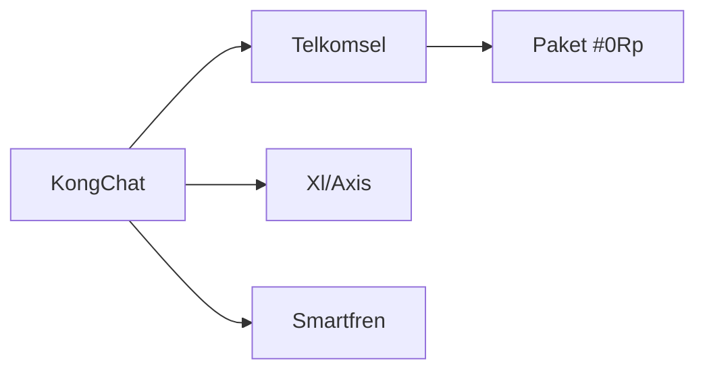

<h1 align="center">🚀 KongChat App 🇮🇩</h1>

<p align="center">
  
  
  
  
  
  
</p>

<p align="center"><strong>🌐 "Menghubungkan Indonesia dan dunia dengan kesetaraan digital."</strong></p>

<p align="center">
  Made with 💻 + ☕ by <b>Kongali1720</b>
</p>

<p align="center">
  
</p>

---

## 🧠 Deskripsi

**KongChat** adalah aplikasi chat **inovatif** yang dirancang khusus untuk menjangkau pengguna di Indonesia dan negara berkembang.  
Fokus kami adalah menghadirkan pengalaman komunikasi **nyaman, aman, dan cepat**, dengan meminimalkan batasan teknis dan sosial-ekonomi.

## 📜 Filosofi Pengembangan

✨ KongChat dibangun berdasarkan **4 prinsip utama**:

- 🔗 **Kesetaraan Digital** – Semua pengguna mendapatkan akses fitur yang **sama** tanpa diskriminasi.
- 🔒 **Privasi Utama** – Menggunakan **end-to-end encryption (E2EE)** di seluruh komunikasi.
- ⚡ **Ramah Sumber Daya** – Optimal untuk perangkat dengan spesifikasi rendah & jaringan terbatas.
- 🇮🇩 **Lokal Konten** – Emoji, stiker, dan suara notifikasi khas **budaya Indonesia**.

---

## 🧱 Struktur Proyek

kongchat-v1.0-pro/ 
  * │ ├── frontend/ # Progressive Web App (PWA)
  * │ ├── index.html # UI Responsif + PWA manifest
  * │ ├── style.css # Desain Material You + Dark/Light Auto
  * │ ├── app.js # Real-time + Offline support
  * │ └── assets/ # Aset Indonesia Lokal
  * │
  * ├── backend/
  * │ ├── server/ # WebSocket + REST Hybrid API
  * │ │ ├── main.py
  * │ │ ├── auth.py # 2FA Otentikasi
  * │ │ ├── database/
  * │ │ │ └── encrypted.db # AES-256 SQLite
  * │ │ └── rooms.py
  * │ └── deployment/
  * │ └── docker-compose.yml
  * │
  * ├── mobile/
  * │ ├── android/ # Dukungan APK
  * │ └── ios/ # Dukungan Xcode
  * │
  * ├── cli/
  * ├── kongchat_cli.py # Terminal Chat (multi-platform)
  * └── tts.py # Text-to-Speech Friendly
  * │
  * ├── features/
  * │ ├── e2ee/ # End-to-End Encryption
  * │ ├── voip/ # Voice/Video WebRTC
  * │ ├── broadcast/ # Broadcast Fitur
  * │ ├── payments/ # KongPay (QRIS)
  * │ └── bot/
  * │ └── kongbot.py # Multilingual AI Chatbot  
  * │
  * ├── docs/
  * │ ├── ID.md # Dokumentasi Bahasa Indonesia
  * │ └── SECURITY.md # Keamanan & Audit  
  * │
  * ├── tests/
  * │ ├── stress_test.py # Load Test >10k Users
  * │ └── security_audit.py # Audit Enkripsi
  * │
  * ├── README.md
  * ├── LICENSE # AGPLv3
  * └── deploy.sh # Skrip Deploy Otomatis

---

## 🔥 Fitur Unggulan

✅ End-to-End Encryption (E2EE)  
✅ Voice & Video Call (WebRTC)  
✅ Chatbot Multibahasa dengan AI  
✅ QRIS Payment System (KongPay)  
✅ Notifikasi & Emoji Khas Nusantara  
✅ Dukungan CLI & Offline Mode  
✅ Stress Test hingga 10.000+ pengguna

---

## 🛡️ Keamanan

KongChat didesain dengan keamanan sebagai **prioritas utama**:
  - 🔐 Enkripsi AES-256 untuk database lokal
  - 📲 WebSocket aman (WSS)
  - 👥 Autentikasi dua faktor (2FA)
  - 🧪 Audit keamanan rutin

> 📘 Baca lebih lanjut di `docs/SECURITY.md`

---

## 🧪 Testing & Stabilitas

Kami menyediakan:
  - Uji performa masif (`stress_test.py`)
  - Uji keamanan enkripsi (`security_audit.py`)
  - CI/CD dengan validasi otomatis

---

## 🚀 Deployment

Jalankan KongChat secara cepat:

```bash
chmod +x deploy.sh
./deploy.sh
```

Tersedia untuk cloud maupun on-premise.

---

## 🛠️ Roadmap Pengembangan

KongChat dikembangkan secara bertahap agar stabil, kuat, dan relevan untuk pengguna di Indonesia & negara berkembang.

### 🧩 Fase 2: Fitur Inti _(3 Minggu)_
  - 📞 **Panggilan Suara & Video** menggunakan **WebRTC**
  - 💸 **Sistem Pembayaran QRIS** (KongPay) — bayar langsung via chat!
  - 🖥️ **CLI Client** untuk pengguna di daerah dengan koneksi lemah

### 🔧 Fase 3: Stabilisasi _(1 Minggu)_
  - 🧑‍💻 **Audit Keamanan** oleh Ethical Hacker
  - ⚙️ **Optimasi Performa** untuk perangkat low-end (1GB RAM pun bisa)
  - 📚 **Dokumentasi Lengkap** dalam Bahasa Indonesia (`docs/ID.md`)

---

## 🧬 Teknologi Inti

| Komponen  | Teknologi                  | Catatan                                                                 |
|-----------|----------------------------|-------------------------------------------------------------------------|
| **Frontend** | ReactJS + PWA             | Material Design, Auto Dark/Light, Offline-ready                        |
| **Backend**  | Python (Quart) + WebSocket| Hybrid REST + Realtime, efisien untuk ribuan koneksi                   |
| **Database** | SQLite terenkripsi        | Enkripsi AES-256 di level storage, ringan dan aman                     |
| **Mobile**   | React Native              | Android & iOS build unified                                            |
| **Keamanan** | AES-256 + Curve25519      | End-to-End Encryption + Modern Key Exchange                            |

---

## 🎯 Fokus Prioritas

KongChat tidak hanya "kerja", tapi **berdampak sosial nyata**:

  - ✅ **End-to-End Encryption**: *Privasi bukan fitur, tapi hak.*
  - ⚙️ **Dukungan Perangkat Rendah**: Dirancang untuk berjalan optimal di HP jadul sekalipun
  - ♿ **Aksesibilitas Disabilitas**: Text-to-Speech dan Navigasi CLI
  - 🇮🇩 **Lokal Konten Nusantara**: Emoji, stiker, dan suara lokal jadi identitas

---

## 🔓 Komitmen Open Source

> “KongChat akan selalu bebas, terbuka, dan bisa dikembangkan siapa saja.”

Dengan lisensi **AGPLv3**, kamu:
  - Bebas melihat dan modifikasi kode
  - Bebas deploy untuk komunitasmu sendiri
  - Tetap harus membagikan perubahan jika kamu merilis versi publik

---

## 📡 Strategi Multi-Dimensi KongChat

  * KongChat dirancang bukan hanya sebagai aplikasi chatting biasa, tapi sebagai **gerakan literasi digital inklusif**. 
  * Dengan pendekatan strategis teknis, sosial, dan ekonomi, KongChat fokus pada jangkauan luas dan dampak sosial nyata, terutama di **daerah 3T dan negara berkembang**.

---

### 1️⃣ Aksesibilitas Teknis

#### 🌐 Multi-Platform Support
  - ✅ **Web PWA** — Akses instan via browser tanpa instalasi
  - ✅ **Android APK kecil (<5MB)** — Ramah untuk pengguna jaringan lambat
  - ✅ **CLI** — Text-only client untuk bandwidth terbatas
  - ✅ **Kompatibel hingga Android 5.0 (Lollipop)**
  - ✅ **Browser dukungan 5 tahun ke belakang**

#### 🛰️ Optimasi Jaringan Lemah
  - 📡 Protokol untuk jaringan **2G/3G**
  - 🖼️ Kompresi gambar otomatis (≤20KB thumbnail)
  - 🔤 Mode **Teks-Saja** untuk hemat data ekstrem

### 2️⃣ Strategi Distribusi

#### 🚀 Instalasi Offline
  - 💽 Distribusi via **USB** ke pesantren/sekolah terpencil
  - 🖥️ Installer mandiri di **warnet** dan balai desa

#### 🤝 Kemitraan Strategis
  - 📶 Bundle data dengan **Telkomsel, XL, Indosat**
  - 🏛️ Integrasi dengan layanan publik seperti **BPJS, PLN**

#### 🏪 Optimalisasi App Store
  - ✅ Listing di **Play Store, AppGallery, F-Droid**
  - 🎯 SEO & Keyword targeting lokal (e.g., “chat Indonesia ringan”)

### 3️⃣ Pendekatan Sosial

#### 👥 Basis Komunitas
  - 🤲 Onboarding via **ormas Islam** (NU, Muhammadiyah)
  - 🏫 Pelatihan di **pesantren & sekolah vokasi**

#### 🎭 Konten Lokal Relevan
  - 🎨 Sticker Pack: **Wayang, Rendang, Kopi, dll**
  - 📺 Channel edukasi: **dakwah, pertanian, UMKM**

#### 💰 Program Afiliasi
  - 🎁 Pulsa reward untuk referal aktif
  - 💸 Cashback KongPay saat transaksi pertama

### 4️⃣ Model Keberlanjutan

#### 🔐 Zero Monetization Data
  - ❌ Tidak menjual data pengguna
  - ✅ Pendapatan dari fitur premium non-esensial:
  - 🎨 Tema custom
  - 🌟 Stiker premium karya lokal
  - ✅ Akun terverifikasi untuk UMKM

#### 🔋 Infrastruktur Hemat
  - 🧠 **Arsitektur server terdistribusi**
  - 📁 **Peer-to-peer file sharing** untuk efisiensi besar

### 5️⃣ Pengukuran Jangkauan

#### 📈 Indikator Utama

```python
def calculate_outreach():
    rural_users = count_users_from(postcodes=remote_areas)
    low_end_users = count_users_with(device_ram='<2GB')
    accessibility_users = count_users_using(feature='tts_mode')
    
    return {
        'total_users': total_active_users(),
        'inclusivity_index': (rural_users + low_end_users) * 2 + accessibility_users
    }
```

## 🎯 Target 1 Tahun

  - 1 Juta Pengguna Terdaftar
  - 40% dari Daerah Non-Urban
  - 20% Memakai Fitur Aksesibilitas
  - ⚙️ Implementasi Teknis Krusial

## 🧩 A. Offline PWA 

```
// sw.js – Cache asset penting
const CACHE_NAME = 'kongchat-v1-static';
const urlsToCache = [
  '/',
  '/index.html',
  '/app.js',
  '/style.css',
  '/assets/icons/logo-48.png'
];

self.addEventListener('install', event => {
  event.waitUntil(
    caches.open(CACHE_NAME)
      .then(cache => cache.addAll(urlsToCache))
  );
});
```

## 🖼️ B. Adaptive Image Loading

```
// app.js – Gambar low-res untuk koneksi 2G
if (navigator.connection.effectiveType === '2g') {
  document.querySelectorAll('img').forEach(img => {
    img.src = img.dataset.lowres; // Atribut data-lowres digunakan
  });
}
```

## 📟 C. CLI untuk Jaringan Sangat Lemah

```
#!/bin/bash
# cli/low_network_mode.sh – Mode teks-only
kongchat_cli --protocol=txtonly --compression=zstd
```

## 🪄 Langkah Taktis Pertama

  - 🔓 Beta Terbuka
  - 🎯 100 Pesantren sebagai early adopters
  - 🐞 Program Bug Bounty: Reward laporan keamanan
  - 📣 Kampanye Sosial
    
## 📱 “Sejuta Pesan Dakwah Digital” – kolaborasi ormas Islam
  - 🛍️ KongChat UMKM Festival – diskon untuk merchant peserta
  - 🏛️ Advokasi Regulasi

## 📄 Audiensi dengan Kominfo untuk sertifikasi lokal
  - 🤝 Kerjasama Kemendes PDTT untuk digitalisasi desa

# KongChat adalah gerakan — bukan hanya aplikasi.
# Fokus kami: akses untuk semua, dari kota hingga pelosok.

---

## 🧭 Arsitektur Distribusi KongChat

  - Strategi penyebaran KongChat mengadopsi pendekatan **multi-platform adaptif**, sehingga dapat menjangkau pengguna dari perangkat flagship sampai feature phone.
  
## Berikut adalah visualisasi alur distribusinya:


---

# Penjelasan Singkat:

* KongChat App adalah basis teknologi utama yang dapat diturunkan ke berbagai jenis platform.
* Android: Dukungan penuh dengan versi APK ultra-ringan untuk pengguna di area dengan koneksi lemah.
* iOS: Versi React Native untuk pengguna Apple.
* Web PWA: Tanpa install, bisa langsung diakses via browser dan offline-capable.
* CLI/Linux: Mode teks-only untuk jaringan ekstrem (2G/satelit).

# Feature Phone: Distribusi berbasis SMS Gateway untuk komunikasi dasar.

# 🎯 Tujuan utama: 
 * Tak ada satupun yang tertinggal, baik dari segi teknologi maupun infrastruktur.

---

## 🚦 Optimalisasi Jaringan & Dukungan Perangkat Lama

### b. Optimisasi Jaringan Lemah

- **📡 Data Saving Mode**  
  Kompresi otomatis gambar dan video, cocok untuk koneksi terbatas.
- **🔄 Protokol Adaptif**  
  Otomatis beralih antara WebSocket & HTTP polling tergantung kualitas jaringan.
- **📶 Offline-First Design**  
  Kirim pesan tetap bisa dilakukan walau offline, terkirim saat koneksi tersedia.

### c. Dukungan Perangkat Lama

- Target minimal: **Android 4.4 (KitKat)**
- Optimalisasi khusus untuk **RAM <1GB**

---

## ♿ Strategi Aksesibilitas

### a. Antarmuka Inklusif (JS Implementation)

```javascript
// frontend/accessibility.js
function enableAccessibility() {
    implementScreenReaderSupport(); // Untuk tunanetra
    addVoiceControl();              // Untuk disabilitas motorik
    applyHighContrastTheme();      // Mode kontras tinggi
    enableTTS(messageContainer);   // Text-to-Speech
}
```

####  b. Bahasa Lokal & Budaya
  * 🌍 10+ bahasa daerah (Jawa, Sunda, Minang, Bugis...)
  * 💬 Terjemahan komunitas via crowdsourcing

### c. Akses Non-Smartphone
  * 📲 SMS Gateway: *555*<nomor>*<pesan>#
  * 🔡 USSD Integration untuk daerah terpencil
  * 🌱 Strategi Penyebaran Sosial

## a. Model "Seva" (Layanan Sosial)
  * KongChat Pendidikan 🎓 — Kerja sama Kemendikbud
  * KongChat UMKM 🛒 — Fitur katalog produk
  * KongChat Desa 🏡 — Modul info desa

### b. Jaringan Komunitas
  * 1.000+ pelatihan digital di desa
  * Dakwah digital via ormas Islam
  * Program ambassador pesantren & kampus

### c. Konten Lokal
  * 🎭 Sticker: Wayang, Rendang, Tradisi Nusantara
  * 😄 Emoji: Target “Emoji terbanyak dari budaya Indonesia”
  * 💰 Model Ekonomi Berkelanjutan

### a. Zero-Rating Partnership



### b. Monetisasi Etis
   ✅ Verifikasi UMKM (Rp10.000/bulan)
   🎨 Tema premium budaya (Rp5.000/tema)
   🤝 Donasi sosial, tanpa iklan

### c. Infrastruktur Terdistribusi
   34 Mirror server provinsi
   Node relawan (mirip arsitektur Tor)

## 🤝 Strategi Kemitraan

### a. Pemerintah
   MoU dengan Kominfo
   Integrasi layanan publik (BPJS, PJT, Dukcapil)

### b. Swasta
   Kemitraan BUMN (BRI, Telkom, PLN)
   Dukungan e-commerce lokal

### c. Organisasi Masyarakat
  NU, Muhammadiyah, Persis
  Relawan TIK Indonesia

# 📊 Pengukuran Dampak Inklusif

## a. Pseudocode Indeks Inklusi


