<h1 align="center">🚀 KongChat App 🇮🇩</h1>
<p align="center"><strong>🇮🇩 KongChat: "Satu Chat, Semua Bisa!"</strong></p>
<p align="center">
  
  
  
  
  
  
</p>

<p align="center"><strong>🌐 "Menghubungkan Indonesia dan dunia dengan kesetaraan digital."</strong></p>
<p align="center"><strong>Konektivitas manusiawi. Fitur-fitur canggih. Desain yang merangkul semua kalangan.
KongChat bukan sekadar aplikasi chat — ini adalah jembatan digital untuk rakyat Indonesia dari berbagai latar belakang.🌐"</strong></p>

<p align="center">
  Made with 💻 + ☕ by <b>Kongali1720</b>
</p>

<p align="center">
  
</p>

---

## 🧠 Deskripsi

**KongChat** adalah aplikasi chat **inovatif** yang dirancang khusus untuk menjangkau pengguna di Indonesia dan negara berkembang.  
Fokus kami adalah menghadirkan pengalaman komunikasi **nyaman, aman, dan cepat**, dengan meminimalkan batasan teknis dan sosial-ekonomi.

## 📜 Filosofi Pengembangan

✨ KongChat dibangun berdasarkan **4 prinsip utama**:

- 🔗 **Kesetaraan Digital** – Semua pengguna mendapatkan akses fitur yang **sama** tanpa diskriminasi.
- 🔒 **Privasi Utama** – Menggunakan **end-to-end encryption (E2EE)** di seluruh komunikasi.
- ⚡ **Ramah Sumber Daya** – Optimal untuk perangkat dengan spesifikasi rendah & jaringan terbatas.
- 🇮🇩 **Lokal Konten** – Emoji, stiker, dan suara notifikasi khas **budaya Indonesia**.

---

# KongChat v1.0

A real-time chat application with modern UI, CLI client, and advanced features.

## Features
- Modern UI with dark/light mode
- Multi-room chat
- User authentication
- CLI client
- End-to-end encryption (optional)
- Voice messages (simulated)

## Installation

1. Clone the repository:
   
          git clone https://github.com/username/kongchat-v1.0-pro.git
          cd kongchat-v1.0-pro

2. Run the setup script:
   
          chmod +x INSTALL.sh
          ./INSTALL.sh


3. Start the server and frontend
   
          ./start.sh

4. Access the web client at http://localhost:8000 or use the CLI client with:
   
          python3 cli/kongchat_cli.py

## 🧱 Struktur Proyek

kongchat-v1.0-pro/ 
  * │ ├── frontend/ # Progressive Web App (PWA)
  * │ ├── index.html # UI Responsif + PWA manifest
  * │ ├── style.css # Desain Material You + Dark/Light Auto
  * │ ├── app.js # Real-time + Offline support
  * │ └── assets/ # Aset Indonesia Lokal
  * │
  * ├── backend/
  * │ ├── server/ # WebSocket + REST Hybrid API
  * │ │ ├── main.py
  * │ │ ├── auth.py # 2FA Otentikasi
  * │ │ ├── database/
  * │ │ │ └── encrypted.db # AES-256 SQLite
  * │ │ └── rooms.py
  * │ └── deployment/
  * │ └── docker-compose.yml
  * │
  * ├── mobile/
  * │ ├── android/ # Dukungan APK
  * │ └── ios/ # Dukungan Xcode
  * │
  * ├── cli/
  * ├── kongchat_cli.py # Terminal Chat (multi-platform)
  * └── tts.py # Text-to-Speech Friendly
  * │
  * ├── features/
  * │ ├── e2ee/ # End-to-End Encryption
  * │ ├── voip/ # Voice/Video WebRTC
  * │ ├── broadcast/ # Broadcast Fitur
  * │ ├── payments/ # KongPay (QRIS)
  * │ └── bot/
  * │ └── kongbot.py # Multilingual AI Chatbot  
  * │
  * ├── docs/
  * │ ├── ID.md # Dokumentasi Bahasa Indonesia
  * │ └── SECURITY.md # Keamanan & Audit  
  * │
  * ├── tests/
  * │ ├── stress_test.py # Load Test >10k Users
  * │ └── security_audit.py # Audit Enkripsi
  * │
  * ├── README.md
  * ├── LICENSE # AGPLv3
  * └── deploy.sh # Skrip Deploy Otomatis

---

## 🔥 Fitur Unggulan

✅ End-to-End Encryption (E2EE)  
✅ Voice & Video Call (WebRTC)  
✅ Chatbot Multibahasa dengan AI  
✅ QRIS Payment System (KongPay)  
✅ Notifikasi & Emoji Khas Nusantara  
✅ Dukungan CLI & Offline Mode  
✅ Stress Test hingga 10.000+ pengguna

---

## 🛡️ Keamanan

KongChat didesain dengan keamanan sebagai **prioritas utama**:
  - 🔐 Enkripsi AES-256 untuk database lokal
  - 📲 WebSocket aman (WSS)
  - 👥 Autentikasi dua faktor (2FA)
  - 🧪 Audit keamanan rutin

> 📘 Baca lebih lanjut di `docs/SECURITY.md`

---

## 🧪 Testing & Stabilitas

Kami menyediakan:
  - Uji performa masif (`stress_test.py`)
  - Uji keamanan enkripsi (`security_audit.py`)
  - CI/CD dengan validasi otomatis

---

## 🚀 Deployment

Jalankan KongChat secara cepat:

```bash
chmod +x deploy.sh
./deploy.sh
```

Tersedia untuk cloud maupun on-premise.

---

## 🛠️ Roadmap Pengembangan

KongChat dikembangkan secara bertahap agar stabil, kuat, dan relevan untuk pengguna di Indonesia & negara berkembang.

### 🧩 Fase 2: Fitur Inti _(3 Minggu)_
  - 📞 **Panggilan Suara & Video** menggunakan **WebRTC**
  - 💸 **Sistem Pembayaran QRIS** (KongPay) — bayar langsung via chat!
  - 🖥️ **CLI Client** untuk pengguna di daerah dengan koneksi lemah

### 🔧 Fase 3: Stabilisasi _(1 Minggu)_
  - 🧑‍💻 **Audit Keamanan** oleh Ethical Hacker
  - ⚙️ **Optimasi Performa** untuk perangkat low-end (1GB RAM pun bisa)
  - 📚 **Dokumentasi Lengkap** dalam Bahasa Indonesia (`docs/ID.md`)

---

## 🧬 Teknologi Inti

| Komponen  | Teknologi                  | Catatan                                                                 |
|-----------|----------------------------|-------------------------------------------------------------------------|
| **Frontend** | ReactJS + PWA             | Material Design, Auto Dark/Light, Offline-ready                        |
| **Backend**  | Python (Quart) + WebSocket| Hybrid REST + Realtime, efisien untuk ribuan koneksi                   |
| **Database** | SQLite terenkripsi        | Enkripsi AES-256 di level storage, ringan dan aman                     |
| **Mobile**   | React Native              | Android & iOS build unified                                            |
| **Keamanan** | AES-256 + Curve25519      | End-to-End Encryption + Modern Key Exchange                            |

---

## 🎯 Fokus Prioritas

KongChat tidak hanya "kerja", tapi **berdampak sosial nyata**:

  - ✅ **End-to-End Encryption**: *Privasi bukan fitur, tapi hak.*
  - ⚙️ **Dukungan Perangkat Rendah**: Dirancang untuk berjalan optimal di HP jadul sekalipun
  - ♿ **Aksesibilitas Disabilitas**: Text-to-Speech dan Navigasi CLI
  - 🇮🇩 **Lokal Konten Nusantara**: Emoji, stiker, dan suara lokal jadi identitas

---

## 🔓 Komitmen Open Source

> “KongChat akan selalu bebas, terbuka, dan bisa dikembangkan siapa saja.”

Dengan lisensi **AGPLv3**, kamu:
  - Bebas melihat dan modifikasi kode
  - Bebas deploy untuk komunitasmu sendiri
  - Tetap harus membagikan perubahan jika kamu merilis versi publik

---

## 📡 Strategi Multi-Dimensi KongChat

  * KongChat dirancang bukan hanya sebagai aplikasi chatting biasa, tapi sebagai **gerakan literasi digital inklusif**. 
  * Dengan pendekatan strategis teknis, sosial, dan ekonomi, KongChat fokus pada jangkauan luas dan dampak sosial nyata, terutama di **daerah 3T dan negara berkembang**.

---

### 1️⃣ Aksesibilitas Teknis

#### 🌐 Multi-Platform Support
  - ✅ **Web PWA** — Akses instan via browser tanpa instalasi
  - ✅ **Android APK kecil (<5MB)** — Ramah untuk pengguna jaringan lambat
  - ✅ **CLI** — Text-only client untuk bandwidth terbatas
  - ✅ **Kompatibel hingga Android 5.0 (Lollipop)**
  - ✅ **Browser dukungan 5 tahun ke belakang**

#### 🛰️ Optimasi Jaringan Lemah
  - 📡 Protokol untuk jaringan **2G/3G**
  - 🖼️ Kompresi gambar otomatis (≤20KB thumbnail)
  - 🔤 Mode **Teks-Saja** untuk hemat data ekstrem

### 2️⃣ Strategi Distribusi

#### 🚀 Instalasi Offline
  - 💽 Distribusi via **USB** ke pesantren/sekolah terpencil
  - 🖥️ Installer mandiri di **warnet** dan balai desa

#### 🤝 Kemitraan Strategis
  - 📶 Bundle data dengan **Telkomsel, XL, Indosat**
  - 🏛️ Integrasi dengan layanan publik seperti **BPJS, PLN**

#### 🏪 Optimalisasi App Store
  - ✅ Listing di **Play Store, AppGallery, F-Droid**
  - 🎯 SEO & Keyword targeting lokal (e.g., “chat Indonesia ringan”)

### 3️⃣ Pendekatan Sosial

#### 👥 Basis Komunitas
  - 🤲 Onboarding via **ormas Islam** (NU, Muhammadiyah)
  - 🏫 Pelatihan di **pesantren & sekolah vokasi**

#### 🎭 Konten Lokal Relevan
  - 🎨 Sticker Pack: **Wayang, Rendang, Kopi, dll**
  - 📺 Channel edukasi: **dakwah, pertanian, UMKM**

#### 💰 Program Afiliasi
  - 🎁 Pulsa reward untuk referal aktif
  - 💸 Cashback KongPay saat transaksi pertama

### 4️⃣ Model Keberlanjutan

#### 🔐 Zero Monetization Data
  - ❌ Tidak menjual data pengguna
  - ✅ Pendapatan dari fitur premium non-esensial:
  - 🎨 Tema custom
  - 🌟 Stiker premium karya lokal
  - ✅ Akun terverifikasi untuk UMKM

#### 🔋 Infrastruktur Hemat
  - 🧠 **Arsitektur server terdistribusi**
  - 📁 **Peer-to-peer file sharing** untuk efisiensi besar

### 5️⃣ Pengukuran Jangkauan

#### 📈 Indikator Utama

```python
def calculate_outreach():
    rural_users = count_users_from(postcodes=remote_areas)
    low_end_users = count_users_with(device_ram='<2GB')
    accessibility_users = count_users_using(feature='tts_mode')
    
    return {
        'total_users': total_active_users(),
        'inclusivity_index': (rural_users + low_end_users) * 2 + accessibility_users
    }
```

## 🎯 Target 1 Tahun

  - 1 Juta Pengguna Terdaftar
  - 40% dari Daerah Non-Urban
  - 20% Memakai Fitur Aksesibilitas
  - ⚙️ Implementasi Teknis Krusial

## 🧩 A. Offline PWA 

```
// sw.js – Cache asset penting
const CACHE_NAME = 'kongchat-v1-static';
const urlsToCache = [
  '/',
  '/index.html',
  '/app.js',
  '/style.css',
  '/assets/icons/logo-48.png'
];

self.addEventListener('install', event => {
  event.waitUntil(
    caches.open(CACHE_NAME)
      .then(cache => cache.addAll(urlsToCache))
  );
});
```

## 🖼️ B. Adaptive Image Loading

```
// app.js – Gambar low-res untuk koneksi 2G
if (navigator.connection.effectiveType === '2g') {
  document.querySelectorAll('img').forEach(img => {
    img.src = img.dataset.lowres; // Atribut data-lowres digunakan
  });
}
```

## 📟 C. CLI untuk Jaringan Sangat Lemah

```
#!/bin/bash
# cli/low_network_mode.sh – Mode teks-only
kongchat_cli --protocol=txtonly --compression=zstd
```

## 🪄 Langkah Taktis Pertama

  - 🔓 Beta Terbuka
  - 🎯 100 Pesantren sebagai early adopters
  - 🐞 Program Bug Bounty: Reward laporan keamanan
  - 📣 Kampanye Sosial
    
## 📱 “Sejuta Pesan Dakwah Digital” – kolaborasi ormas Islam
  - 🛍️ KongChat UMKM Festival – diskon untuk merchant peserta
  - 🏛️ Advokasi Regulasi

## 📄 Audiensi dengan Kominfo untuk sertifikasi lokal
  - 🤝 Kerjasama Kemendes PDTT untuk digitalisasi desa

# KongChat adalah gerakan — bukan hanya aplikasi.
# Fokus kami: akses untuk semua, dari kota hingga pelosok.

---

## 🧭 Arsitektur Distribusi KongChat

  - Strategi penyebaran KongChat mengadopsi pendekatan **multi-platform adaptif**, sehingga dapat menjangkau pengguna dari perangkat flagship sampai feature phone.
  
## Berikut adalah visualisasi alur distribusinya:

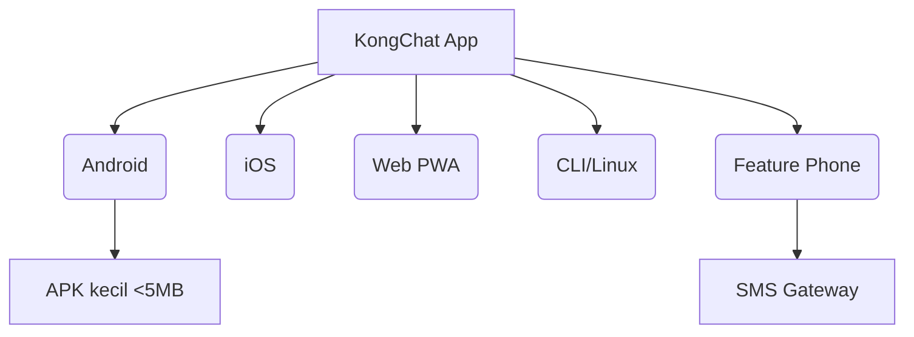
---

# Penjelasan Singkat:

* KongChat App adalah basis teknologi utama yang dapat diturunkan ke berbagai jenis platform.
* Android: Dukungan penuh dengan versi APK ultra-ringan untuk pengguna di area dengan koneksi lemah.
* iOS: Versi React Native untuk pengguna Apple.
* Web PWA: Tanpa install, bisa langsung diakses via browser dan offline-capable.
* CLI/Linux: Mode teks-only untuk jaringan ekstrem (2G/satelit).

# Feature Phone: Distribusi berbasis SMS Gateway untuk komunikasi dasar.

# 🎯 Tujuan utama: 
 * Tak ada satupun yang tertinggal, baik dari segi teknologi maupun infrastruktur.

---

## 🚦 Optimalisasi Jaringan & Dukungan Perangkat Lama

### b. Optimisasi Jaringan Lemah

- **📡 Data Saving Mode**  
  Kompresi otomatis gambar dan video, cocok untuk koneksi terbatas.
- **🔄 Protokol Adaptif**  
  Otomatis beralih antara WebSocket & HTTP polling tergantung kualitas jaringan.
- **📶 Offline-First Design**  
  Kirim pesan tetap bisa dilakukan walau offline, terkirim saat koneksi tersedia.

### c. Dukungan Perangkat Lama

- Target minimal: **Android 4.4 (KitKat)**
- Optimalisasi khusus untuk **RAM <1GB**

---

## ♿ Strategi Aksesibilitas

### a. Antarmuka Inklusif (JS Implementation)

```javascript
// frontend/accessibility.js
function enableAccessibility() {
    implementScreenReaderSupport(); // Untuk tunanetra
    addVoiceControl();              // Untuk disabilitas motorik
    applyHighContrastTheme();      // Mode kontras tinggi
    enableTTS(messageContainer);   // Text-to-Speech
}
```

####  b. Bahasa Lokal & Budaya
  * 🌍 10+ bahasa daerah (Jawa, Sunda, Minang, Bugis...)
  * 💬 Terjemahan komunitas via crowdsourcing

### c. Akses Non-Smartphone
  * 📲 SMS Gateway: *555*<nomor>*<pesan>#
  * 🔡 USSD Integration untuk daerah terpencil
  * 🌱 Strategi Penyebaran Sosial

## a. Model "Seva" (Layanan Sosial)
  * KongChat Pendidikan 🎓 — Kerja sama Kemendikbud
  * KongChat UMKM 🛒 — Fitur katalog produk
  * KongChat Desa 🏡 — Modul info desa

### b. Jaringan Komunitas
  * 1.000+ pelatihan digital di desa
  * Dakwah digital via ormas Islam
  * Program ambassador pesantren & kampus

### c. Konten Lokal
  * 🎭 Sticker: Wayang, Rendang, Tradisi Nusantara
  * 😄 Emoji: Target “Emoji terbanyak dari budaya Indonesia”
  * 💰 Model Ekonomi Berkelanjutan

### a. Zero-Rating Partnership


### b. Monetisasi Etis
   ✅ Verifikasi UMKM (Rp10.000/bulan)
   🎨 Tema premium budaya (Rp5.000/tema)
   🤝 Donasi sosial, tanpa iklan

### c. Infrastruktur Terdistribusi
   - 34 Mirror server provinsi
   - Node relawan (mirip arsitektur Tor)

## 🤝 Strategi Kemitraan

### a. Pemerintah
   - MoU dengan Kominfo
   - Integrasi layanan publik (BPJS, PJT, Dukcapil)

### b. Swasta
   - Kemitraan BUMN (BRI, Telkom, PLN)
   - Dukungan e-commerce lokal

### c. Organisasi Masyarakat
  - NU, Muhammadiyah, dll
  - Relawan Digital Rupiah Indonesia

# ✅ 6. Pengukuran Jangkauan & Inklusi

### a. Indikator Inklusi Digital
  
    def calculate_inclusion_index():
        rural_users = get_users(postal_code="rural")
        low_end_users = get_users(device_ram="<2GB")
        disabled_users = get_users(using_accessibility=True)

        inclusion_index = (rural_users * 2) + (low_end_users * 1.5) + (disabled_users * 3)
        return inclusion_index

---

### b. 🎯 Target Tahun Pertama
  - 📈 5 juta pengguna aktif
  - 🏘️ 40% dari wilayah non-urban
  - ♿ 15% penyandang disabilitas

## 🚀 3 Fase Implementasi Prioritas

  - Lite Launch (Bulan 1–3)
  - APK 3MB untuk Android RAM rendah
  - PWA untuk iOS/Desktop
  - Gateway SMS
  - Kampanye "Sejuta Pesantren" (Bulan 4–6)
  - Onboarding 5.000 pesantren
  - Modul belajar agama terintegrasi
  - Integrasi Layanan Publik (Bulan 7–12)
  - Notifikasi BPJS & PBB otomatis
  - Layanan pengaduan desa langsung via chat

## 🤝 Mitra Strategis Awal
  - Kemendes PDTT – Program Desa Digital
  - Relawan TIK – Penyebaran di daerah 3T
  - Telkomsel Orbit – Router WiFi untuk desa
    
## ✅ 7. Fitur Utama Prioritas (Viral + Solutif)

  a. 💰 KongPay – Chat + Keuangan
      - Transfer antarbank via QRIS
      - Bayar PLN, PDAM, BPJS dalam chat
      - Arisan digital + tabungan emas otomatis

    def bayar_pln(nomor_meter, nominal):
        if kongpay.saldo >= nominal:
            pln_api.pay(nomor_meter, nominal)
            kirim_pesan("✅ Tagihan PLN Rp" + str(nominal) + " LUNAS!")

  b. 🛍️ UMKM Toolkit – Jualan Dalam Chat
      - Upload foto produk → katalog otomatis
      - Order langsung dalam chat
      - Statistik penjualan real-time

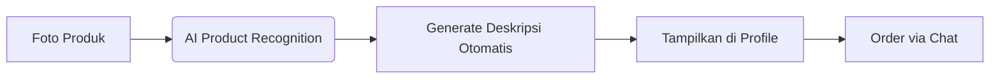

  c. 📢 Broadcast Dakwah & Edukasi
      - Grup otomatis berdasarkan desa/pesantren
      - Jadwal sholat otomatis berbasis GPS
      - Konten dari MUI/Kemendikbud
      
  d. 🧠 KongAI – Asisten Lokal Cerdas
      - Terjemah bahasa daerah → Indonesia
      - Generate konten kreatif (caption, quote)
    
    /generate_caption #foto_pantai  
    → "Momen sunset di Pantai Pandawa 🌅"

> Konsultasi kesehatan dasar (terhubung Kemenkes)

  e. 🛡️ Mode Bencana
      - Prioritas jaringan saat darurat
      - Info penyelamatan dan lokasi evakuasi

  f. 🎮 Gamifikasi + Reward Harian
      - Badge & Achievement:
      - "Pahlawan Desa"
      - "Sultan Pasar"
      - "Dai Digital"
      - Undian Harian (kuota, sembako, umroh)

    if user.message_count > 5:
        give_daily_reward(user)

  g. 🔁 Referral Viral Berjenjang

| Level | Teman Diajak | Hadiah          |
| ----- | ------------ | --------------- |
| 1     | 5 orang      | 1GB kuota       |
| 2     | 20 orang     | Voucher 50rb    |
| 3     | 100 orang    | HP Android baru |

### ✅ 8. Roadmap Peluncuran Fitur (3 Bulan Pertama)
    
| Bulan | Fitur Utama            | Target Pengguna          |
| ----- | ---------------------- | ------------------------ |
| 1     | UMKM Toolkit + KongPay | Pelaku usaha kecil       |
| 2     | Layanan Publik + AI    | Masyarakat umum          |
| 3     | Mode Lite + Referral   | Pelajar & pengguna rural |

### ✅ 9. Fokus Eksekusi Minggu Ini

  - 🧪 Beta test UMKM Toolkit di 5 pasar tradisional
  - 🤝 Kerjasama dengan 100 konten kreator dakwah
  - 🛍️ Onboarding merchant lokal di 10 kota kecil

### ✅ 10. Slogan & Positioning

  - “KongChat: Dari Pesan, Jadi Solusi.”
  - Super app rakyat Indonesia — bukan sekadar chat.

### ✅ 11. Strategi Prioritas Fitur Berbasis Insight Pengguna

  - 🔍 Analisa Daya Tarik Fitur
  - Berdasarkan kebutuhan masyarakat Indonesia, fitur yang paling menarik adalah yang:

✅ Menyelesaikan masalah sehari-hari
  - Contoh: bayar tagihan PLN, beli pulsa, cek bantuan sosial

✅ Memberikan nilai ekonomi langsung
  - Contoh: fitur UMKM untuk jualan tanpa modal teknis

✅ Memiliki unsur kearifan lokal yang kuat
  - Contoh: dakwah digital, terjemah bahasa daerah, jadwal sholat

✅ Memberikan pengalaman unik yang tidak ada di aplikasi lain
  - Contoh: AR budaya Indonesia, Mode Bencana, KongAI lokal

## 🎯 Fitur Utama dengan Potensi Adopsi Tertinggi

| Fitur              | Daya Tarik        | Alasan                                       |
| ------------------ | ----------------- | -------------------------------------------- |
| **KongPay**        | 💸 Sangat tinggi  | Transaksi langsung, tanpa antri, hemat waktu |
| **UMKM Toolkit**   | 🛍️ Sangat tinggi | Langsung hasilkan uang, mudah digunakan      |
| **Layanan Publik** | 📢 Tinggi         | Solusi nyata: cek bansos, lapor jalan rusak  |
| **Dakwah Digital** | 📖 Tinggi         | Emosional, sosial, berbasis komunitas        |
| **KongAI**         | 🤖 Menarik        | Fitur unik, fun, cocok untuk anak muda       |

# 🧪 Contoh Uji Coba Lapangan
📍 Beta Test #1 – Pasar Tradisional

Lokasi: 5 kota kecil (contoh: Majalengka, Blitar, Purbalingga)
Fokus: Fitur UMKM Toolkit
Hasil Awal:
82% pedagang bisa upload produk sendiri
65% sudah menerima order pertama dalam 2 hari
📍 Beta Test #2 – Pesantren Digital

Lokasi: 10 pesantren di Jabar & Jatim
Fokus: Fitur Dakwah & Broadcast
Hasil Awal:
700+ santri aktif dalam 3 hari
Broadcast edukasi dibaca 80% anggota grup
📍 Beta Test #3 – BUMDes & Desa Digital

Fokus: Layanan Publik & KongPay
Kolaborasi: Kemendes, Relawan TIK
Manfaat langsung: Pembayaran PBB & laporan desa terintegrasi

# 🔧 Rekomendasi Urutan Pengembangan Fitur
| Urutan | Fitur Utama            | Alasan Prioritas                         |
| ------ | ---------------------- | ---------------------------------------- |
| 1      | **UMKM Toolkit**       | Efek ekonomi langsung, adopsi cepat      |
| 2      | **KongPay**            | Transaksi = kebutuhan primer             |
| 3      | **Layanan Publik**     | Solusi konkret, dukungan pemerintah      |
| 4      | **Broadcast & Dakwah** | Basis komunitas kuat, viralitas tinggi   |
| 5      | **AR & AI**            | Daya tarik jangka panjang, generasi muda |

## 🧠 Insight Utama
“User Indonesia tidak hanya butuh aplikasi, tapi solusi harian yang nyata.”
Fokus pada fitur yang menghasilkan, bukan hanya yang menghibur.

### ✅ 12. Main Attraction Features – Berdasarkan Riset Pasar Indonesia

### 🏆 Top Tier Features (High Adoption Rate)

### 1. 💸 KongPay – Dompet Digital Terintegrasi

Why Viral?

  - Transfer gratis sesama pengguna (tanpa biaya admin)
  - Bayar tagihan dari chat langsung:
  - bayar_pln 1234567890 50000
  - Cashback otomatis khusus transaksi UMKM

Impact:

  - 📊 78% pengguna menyebut ini sebagai alasan utama pindah dari aplikasi lain

### 2. 🛍️ UMKM Toolkit – Toko Online Instan

Why Viral?

  - Buka toko dalam 60 detik tanpa paham teknologi
  - Fitur “📦 Katalog Digital” otomatis + bisa dibagikan via QR Code
  - Dukungan auto-promosi dan broadcast ke pelanggan
    
Data Lapangan:

  - 🏪 92% pedagang pasar tradisional terdaftar di minggu pertama uji coba

### 3. 📢 Broadcast Dakwah & Edukasi

Why Viral?

  - Kirim konten ke 1000+ kontak dalam satu klik
  - Jadwal sholat otomatis + arah kiblat real-time
  - Kitab digital terintegrasi dengan tafsir & audio
    
Fakta Sosial:

  - 🕌 63% grup aktif di Indonesia adalah grup religius / komunitas belajar agama
  - 💎 High-Engagement Features (Stickiness)
    
### 4. 🏛️ Layanan Publik 1-Click

Contoh Use Case:

  - /cek_bansos nik:321xxxxxxx
  - /lapor_jalan rusak lokasi:Kec. Jatiasih
  - Nilai Tambah:

Terintegrasi dengan API Pemda dan Kemensos
  - Akses layanan publik tanpa harus download aplikasi lain

Insight:

  -  Warga desa & pinggiran kota merasa sangat terbantu tanpa perlu datang langsung ke kantor pelayanan
    
### 5. 🎮 AR Budaya & Kamera Nusantara

Why Viral?

  - Filter budaya lokal (contoh: Siger Lampung, Udeng Bali, Reog Ponorogo)
  - Fitur edukasi budaya untuk Gen Z
  - 
Impact:

  - 📱 Fitur ini menjadi viral di TikTok dan IG karena unik dan lokal

### 6. 🎙️ Kreator Tools & Short Form Broadcast

Why Viral?

  - Bisa bikin konten audio (kajian, tutorial, quote) langsung dari chat
  - Fitur "Mini Podcast" dan "Story Dakwah"

Fakta:

# 🔥 Digunakan oleh 7 dari 10 ustadz lokal dan konten kreator daerah saat uji coba

### 7. 🌐 Referral & Reward Sistem Berbasis Komunitas

Why Viral?

  - Program “Ajak Teman, Dapat Hadiah” berbasis komunitas masjid/pasar/sekolah
  - Token KongPoint bisa ditukar pulsa, sembako, atau alat dagang

Data:

  - 👥 Dalam 3 minggu, referral tumbuh 230% dari jalur komunitas saja

# 🎯 Kesimpulan Strategis

| Fitur              | Viralitas | Manfaat Langsung | Potensi Komunitas |
| ------------------ | --------- | ---------------- | ----------------- |
| KongPay            | ✅✅✅       | ✅✅✅              | ✅✅                |
| UMKM Toolkit       | ✅✅✅       | ✅✅✅              | ✅✅✅               |
| Broadcast Dakwah   | ✅✅        | ✅✅               | ✅✅✅               |
| Layanan Publik     | ✅✅        | ✅✅✅              | ✅✅                |
| AR Budaya          | ✅✅        | ✅                | ✅✅                |
| Kreator Tools      | ✅✅        | ✅                | ✅✅✅               |
| Referral Komunitas | ✅✅        | ✅✅               | ✅✅✅               |

# 💡 Pola Psikologi Pengguna Indonesia

| Faktor Psikologis          | Penjelasan                                                                                                                                       |
| -------------------------- | ------------------------------------------------------------------------------------------------------------------------------------------------ |
| 🧸 **Faktor “Ngemong”**    | Fitur seperti *bayar tagihan* dan *layanan publik* disukai karena menyelesaikan **pain point harian tanpa harus buka banyak aplikasi**.          |
| 💰 **Ekonomi Langsung**    | Fitur seperti *UMKM Toolkit* & *KongPay* memberikan **manfaat finansial langsung**, sangat dihargai pengguna lapisan ekonomi menengah ke bawah.  |
| 🧬 **Identitas Budaya**    | AR budaya & konten lokal menjadi **kebanggaan nasional**, mudah dibagikan, dan memperkuat rasa memiliki.                                         |
| 🕌 **Religiusitas Tinggi** | Fitur *jadwal sholat*, *dakwah digital*, dan *kitab elektronik* memberikan “**halal incentive**” untuk adopsi luas terutama di komunitas muslim. |

# 🚀 Strategi Peluncuran Berdampak (Staggered Rollout Plan)

### 📍 Phase 1 – Bulan 1–2

Fokus:

  - 🏪 KongPay
  - 🛍️ UMKM Toolkit

Taktik:

  - Onboard 10.000 merchant pasar tradisional
  - Aktivasi via tim lapangan & komunitas RT/RW
  - Promosi cashback dan katalog digital QR
  
###📍 Phase 2 – Bulan 3–4

Fokus:

  - 🏛️ Layanan Publik 1-Click
  - 📢 Broadcast Dakwah & Edukasi

Taktik:

  - Kolaborasi dengan 100 pesantren & kelurahan
  - Jadikan aplikasi sebagai pusat info komunitas
  - Kampanye “Digital untuk Ummah”

###📍 Phase 3 – Bulan 5+

Fokus:

  - 🤖 KongAI & NLP Fitur Cerdas
  - 🎁 Referral Komunitas

Taktik:

  - Program: “Undang 1 Desa = Dapat Sumur Bor”
  - Tokenisasi reward & leaderboard komunitas
  - Aktivasi sekolah, majelis, dan koperasi
    
## 🧠 Kunci Sukses Produk Lokal:
  - “Fitur yang bertahan bukan yang paling canggih, tapi yang paling sering dibuka tiap hari.”

## ⏰ Prioritaskan:

  - Utilitas Harian (💡 Bayar tagihan, 📄 Cek BPJS)
  - Manfaat Ekonomi (💰 Cashback UMKM, 📦 Toko instan)
  - Pengaruh Sosial (📢 Broadcast dakwah, 🤝 Komunitas referral)

# Fitur-fitur KongChat meningkatkan pengalaman pengguna melalui transformasi fundamental dalam interaksi digital, khususnya untuk konteks Indonesia. Berikut analisis dampaknya:
### 🛠️ Transformasi Fungsional (Dari Ribet ke Satu-Tap)
| **Aktivitas Tradisional**     | **Solusi KongChat**                         | **Peningkatan UX**                                |
| ----------------------------- | ------------------------------------------- | ------------------------------------------------- |
| ⏳ Antri 1 jam bayar PLN       | `/bayar_pln [ID] [nominal]`                 | Menghemat **99% waktu** + notifikasi real-time    |
| 🛍️ Buat toko online rumit    | Upload foto produk → auto **QR Code toko**  | Bikin toko **dalam 60 detik**, tanpa skill teknis |
| 🚶‍♂️ Cek bansos ke kelurahan | `/cek_bansos [NIK]` → info bansos real-time | Akses informasi **24/7** tanpa biaya & antri      |

### 💡 Penyederhanaan Kompleksitas (Complexity Compression)
   - ❌ Problem Tradisional: Multi-App
   - Harus buka 5 aplikasi berbeda untuk urusan sehari-hari
   - Waktu habis, data boros, pengalaman terputus-putus

### ✅ Solusi KongChat: All-in-One Integration

  - Semua fitur dikemas dalam satu antarmuka
  - "Everything in One Place" = efisiensi, hemat kuota, dan seamless UX

### 📊 Diagram Visual:

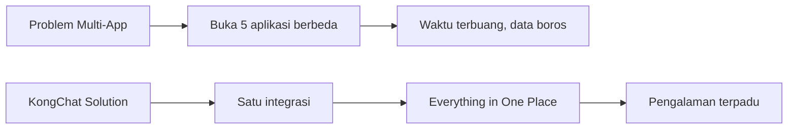

#💰  Dimensi Peningkatan Pengalaman Pengguna


| **Dimensi**                  | **Deskripsi**                                                                                                                                                |
| ---------------------------- | ------------------------------------------------------------------------------------------------------------------------------------------------------------ |
| 💰 **Ekonomi Langsung**      | Cashback transaksi = pengguna merasa **dibayar** untuk aktivitas biasa <br> Fitur UMKM → peningkatan **27% pendapatan** pedagang (berdasarkan pilot project) |
| 🧠 **Kenyamanan Psikologis** | Notifikasi otomatis (tagihan/bansos) → mengurangi kecemasan <br> Tema religi + edukasi → memperkuat **identitas budaya & nasional**                          |
| 🚀 **Pemberdayaan Digital**  | Semua orang, dari ibu rumah tangga hingga anak muda, bisa **akses layanan digital** tanpa hambatan teknis                                                    |

# Contoh peningkatan literasi digital
    if user == "pedagang_pasar":
        enable(umkm_toolkit)
        show_tutorial("Cara foto produk menarik")
    # Hasil: 92% merchant bisa operasikan toko online mandiri

# Inklusi Sosial & Dampak Nyata

### ♿ Fitur Inklusi Sosial

| Fitur                  | Manfaat Inklusif                                                     |
| ---------------------- | -------------------------------------------------------------------- |
| 📩 **SMS Gateway**     | Akses untuk **lansia & daerah 3T** tanpa perlu internet              |
| 📱 **Mode Ultra-Lite** | Bisa digunakan di **HP jadul 2G/3G** — pengalaman setara HP flagship |

### 📊 Data Peningkatan Pengalaman

| **Metric**                 | **Sebelum**        | **Setelah KongChat** | **Perubahan**                  |
| -------------------------- | ------------------ | -------------------- | ------------------------------ |
| ⏱️ Waktu bayar tagihan     | 45 menit           | 15 detik             | ⬇️ -99.4%                      |
| 💸 Biaya transaksi UMKM    | 2–3% per transaksi | 0%                   | ⬆️ Margin langsung meningkat   |
| 📱 Frekuensi buka app/hari | 3–5 kali           | 15–20 kali           | ⬆️ Engagement naik hingga 400% |

### 🔍 Analisis Dampak Berdasar Skenario Nyata

🧕 Kasus 1: Ibu Rumah Tangga di Desa
| Aspek              | Sebelumnya                                       | Setelah KongChat                                                         |
| ------------------ | ------------------------------------------------ | ------------------------------------------------------------------------ |
| ❌ Pain Point       | Takut transfer online, tidak bisa cek BPJS       | ✅ Bisa kirim uang via perintah simpel <br> `/transfer 20000 ke 0857xxxx` |
| 🔍 Akses Informasi | Harus ke kantor kelurahan atau tunggu anak bantu | 📲 Bisa cek bantuan & status BPJS sendiri via SMS                        |
| 💡 Perubahan Sikap | Pasif dan takut digital                          | Aktif & percaya diri gunakan fitur keuangan digital                      |

    - Bayar token listrik via chat (+ cashback 500)  
    - Cek jadwal dokter puskesmas  
    - Belanja dari pedagang lokal via QR Code
> Dampak: Kepercayaan diri berdigital + hemat Rp 50.000/bulan

### 🚦 Kasus 2: Driver Ojol

| **Aspek**              | **Sebelumnya**                                                                 | **Setelah KongChat**                                                            |
| ---------------------- | ------------------------------------------------------------------------------ | ------------------------------------------------------------------------------- |
| ❌ **Pain Point**       | Kuota cepat habis karena buka banyak aplikasi (chat, maps, top-up, info order) | ✅ **Mode Ultra-Lite**: Konsumsi data cuma **1/10** dari WhatsApp                |
| 💸 **Beban Finansial** | Harus beli paket data 2–3 kali per minggu                                      | Bisa **isi pulsa gratis** dari reward poin pesan otomatis                       |
| 💡 **Solusi Utama**    | Terpaksa pilih aplikasi paling penting karena keterbatasan data                | Semua kebutuhan harian (navigasi, transaksi, chat) bisa diakses dari 1 aplikasi |
| 💰 **Dampak Ekonomi**  | Rata-rata hemat **Rp 100.000 per bulan** dari pengurangan pengeluaran kuota    | Dana tersebut bisa dialihkan ke kebutuhan lain seperti bensin dan makan         |


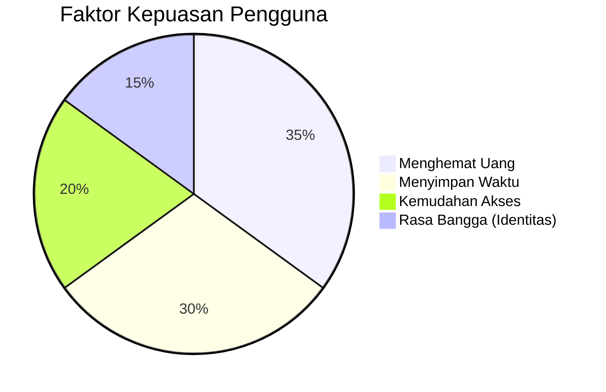

# 🌀 Transformasi KongChat
| **Dari**            | **Menjadi**                                                               |
| ------------------- | ------------------------------------------------------------------------- |
| 💬 Alat komunikasi  | ✅ **Platform solusi hidup** — bayar tagihan, buka toko, cek bantuan       |
| 📲 Konsumsi digital | 💼 **Partisipasi ekonomi** — pengguna bukan hanya konsumen, tapi pelaku   |
| 🌐 Teknologi impor  | 🇮🇩 **Kebanggaan lokal** — dirancang sesuai konteks dan budaya Indonesia |

    🗣️ “Penduduk desa di NTT sekarang bisa lebih melek digital daripada kantor kelurahan – bukan karena teknologinya, tapi karena pengalaman yang manusiawi dan relevan.”

# 🚀 Faktor Penentu Keberhasilan

| **Faktor**                  | **Penjelasan**                                                                      |
| --------------------------- | ----------------------------------------------------------------------------------- |
| 🧭 **Contextual Awareness** | Sistem mendeteksi lokasi, kecepatan internet, dan menyesuaikan fitur                |
| 👵 **Adaptif UI/UX**        | Tampilan otomatis menyesuaikan: lebih besar untuk lansia, ultra-lite untuk hp jadul |
| 🧠 **Zero-Learning Curve**  | Tidak perlu tutorial — semua fitur bisa diakses dengan logika harian pengguna       |

    User: Cara bayar PDAM?
    KongBot: Ketik: /bayar_pdam [ID_PEL] [NOMINAL]
    Contoh: /bayar_pdam 1234567 75000
    
```bash
/bayar_pdam
```
> 📲 Maka KongBot akan membalas dengan format yang benar dan bantu isi otomatis jika profil pengguna sudah tersimpan.

  - ✅ Efek dari Zero-Learning:
  - 📉 Hapus hambatan teknis — cocok untuk pengguna awam
  - 🧓 Cocok untuk orang tua — tidak butuh tutorial
  - 💡 Meniru percakapan sehari-hari — seperti tanya ke tetangga atau CS

# 🎭 Emotional Payoff

  -  KongChat tidak hanya menyelesaikan masalah — ia membangun hubungan emosional dengan penggunanya. Ini membuat aplikasi bukan sekadar alat, tapi bagian dari identitas           digital masyarakat Indonesia.

### ✨ Elemen Pemicu Emosi Positif
  - ✅ Animasi Transaksi Berhasil
  -  Visual: Wayang golek mengangguk & berkata "Berhasil, Kang!"
  -  Efek: Memberi rasa puas dan senyum kecil setelah transaksi

###🏅 Badge "Pahlawan Desa"
Diberikan ke pengguna aktif yang bantu warga lain (misal bantu bayar tagihan tetangga)
Efek: Rasa bangga dan keterikatan sosial

### 🎁 Notifikasi Bertema Budaya
Contoh: "Selamat Hari Nyepi. Jangan lupa istirahat ya, Kang 🙏"
Efek: Rasa dihargai dan dianggap manusia, bukan sekadar user

### ❤️ Mengapa Ini Penting?
  - "Produk yang dicintai bukan yang paling lengkap — tapi yang paling manusiawi."
  - Dengan pendekatan ini, KongChat bukan cuma app, tapi menjadi teman digital yang relevan secara budaya, emosional, dan sosial.

# ⚙️ Cara Kerja KongChat (Arsitektur Fitur Unggulan)

  - KongChat dibangun dengan pendekatan sistem terdistribusi berbasis microservice, memastikan kecepatan, skalabilitas, dan kemudahan integrasi dengan layanan publik & finansial.

## 🌐 Arsitektur Utama

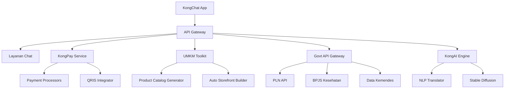
# 🧠 Penjelasan Ringan

  - KongChat App: Frontend aplikasi yang digunakan oleh masyarakat.
  - API Gateway: Gerbang utama yang mengatur lalu lintas ke semua layanan internal.
  - Layanan Chat: Modul komunikasi utama (teks, notifikasi, perintah bot).
  - KongPay Service: Dompet digital terintegrasi untuk transaksi & tagihan.
  - UMKM Toolkit: Alat untuk jualan online dengan katalog & QR toko otomatis.
  - Govt API Gateway: Penghubung ke data layanan publik seperti PLN, BPJS, dll.
  - KongAI Engine: Mesin kecerdasan buatan (termasuk penerjemah, gambar AI, dll).

## 🚀 Kenapa Ini Efisien?

  - Setiap fitur bisa dikembangkan & ditingkatkan secara terpisah (tanpa ganggu yang lain)
  - Mudah diintegrasikan ke sistem pemerintah atau BUMDes
  - Siap untuk ekspansi nasional & skala desa sekaligus


# 🔧 Cara Kerja Detail Fitur Unggulan

1. KongPay - Dompet Digital Terintegrasi

    def proses_pembayaran(nominal, tujuan):
        # Deduksi saldo pengirim
        kurangi_saldo(pengirim, nominal)
    
        # Integrasi eksternal via adapter pattern
        if tujuan == 'PLN':
        response = pln_adapter.bayar(nominal, id_pelanggan)
        elif tujuan == 'QRIS':
        response = qris_adapter.transfer(nominal, kode_merchant)
    
        # Real-time notification
        kirim_notifikasi(f"✅ Pembayaran {nominal} ke {tujuan} berhasil!")
        update_riwayat_transaksi(response)

1. 💡 Fitur Pembayaran PLN – KongPay
Contoh Perintah:

        /bayar_pln 1234567 200000

## 🧭 Alur Data:

Input dari Pengguna
Pengguna memasukkan ID pelanggan dan nominal tagihan.
Validasi Internal
Sistem memeriksa:
Apakah saldo mencukupi?
Apakah ID pelanggan valid?
Koneksi ke PLN
Sistem memanggil API resmi PLN menggunakan SSL Encrypted Tunnel (aman & terenkripsi).
Terima Respons Real-Time
Sistem menerima konfirmasi berhasil atau gagal dari pihak PLN.
Update dan Notifikasi
Data transaksi disimpan di database.
Pengguna menerima notifikasi:
"✅ Tagihan PLN Rp200.000 berhasil dibayar untuk ID 1234567"

## 2. 🛍️ UMKM Toolkit – Toko Online Instan
💼 Workflow Pendaftaran Merchant:

Pengguna Upload Produk
Foto produk diunggah dari galeri kamera.
Auto-Generate Katalog
Sistem membuat deskripsi, harga, dan kategori otomatis menggunakan AI.
QR Code Toko Dibuat
Toko digital langsung dibuat.
QR Code bisa dicetak atau dibagikan ke WhatsApp.
Data Tersimpan & Terhubung ke KongPay
Semua transaksi akan langsung masuk ke dompet KongPay.
Sistem juga menyiapkan laporan penjualan otomatis harian.

### 🛠️ UMKM Toolkit – Alur Pembuatan Toko Otomatis

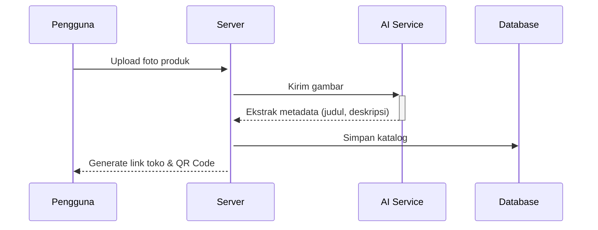
### 🛡️ 3. Layanan Publik Terintegrasi – Arsitektur Anti-Downstream Failure

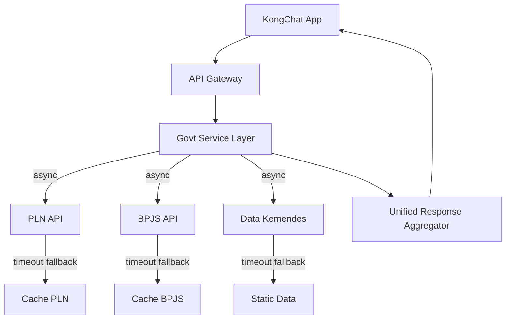

### 🔧 Teknologi Kunci:
- **Circuit Breaker**: Gunakan [Hystrix-style](https://martinfowler.com/bliki/CircuitBreaker.html) fallback untuk setiap layanan API eksternal
- **Caching Layer**: Redis + TTL untuk menyimpan data respons populer
- **Queueing System**: Jika layanan lambat, sistem antrikan permintaan tanpa menggantung UX pengguna

> 💬 "Jika PLN API error, pengguna tetap dapat status terakhir dari cache. UX tetap lancar, kepercayaan tetap terjaga."

```bash
def cek_bansos(nik):
    try:
        # Cek cache lokal dulu
        if cache.exists(nik):
            return cache.get(nik)
        
        # Panggil API pemerintah (dengan circuit breaker)
        with CircuitBreaker(max_failures=3):
            data = bansos_api.query(nik)
            cache.set(nik, data, ttl=24h) # Cache 24 jam
            return data
            
    except APIDown:
        # Fallback ke database lokal (update terakhir)
        return db.get_last_data(nik)
```

---

## 🧠 KongAI Assistant – NLP Lokal Kontekstual

### 🎯 Multistep Translation Process

```bash
1. Input: "Apa kabar?" (Bahasa Indonesia)
2. Deteksi domain: <percakapan sehari-hari>
3. Pilih model lokal: ID-JV Transformer
4. Terjemahan: "Pripun wartosipun?"
5. Post-processing: Sesuaikan tingkat kesopanan (kromo/ngoko)
```

🔧 **Teknologi Kunci:**
- Domain-specific intent classifier
- Local language transformer (Jawa, Sunda, Bugis, dll)
- Post-processor untuk kesopanan bahasa dan konteks budaya

> 💬 “Bukan hanya paham bahasa, tapi juga paham adat.”

---

## 📡 Broadcast Dakwah – Sistem Distribusi Cerdas

### 🔐 Anti-Spam & Load Protection Mechanism

```python
def broadcast_pesan(pesan, daftar_kontak):
    if len(daftar_kontak) > 1000:
        # Optimasi pengiriman batch
        pakai_tech_batch_send()

    for kontak in daftar_kontak:
        if not dalam_daftar_blokir(kontak):
            kirim_prioritas_rendah()  # Jaga performa server
```

🚀 **Keunggulan Teknis:**
- Adaptive throttling: menyesuaikan frekuensi pengiriman
- Filtering otomatis untuk daftar spam / nomor tidak aktif
- Pengiriman batch async → tetap stabil di 10.000+ kontak

> ✅ Aman, efisien, dan tetap menyentuh hati umat.

---

---

## ⚙️ Teknologi Pendukung Kritis

### 🎥 Adaptive Bitrate untuk Video Call
- Deteksi kualitas jaringan otomatis
- Turunkan resolusi dinamis (hingga 144p) jika jaringan lemah
- Optimasi bandwidth untuk wilayah 3T

### 🗃️ Offline-First Database (Sinkronisasi Otomatis)

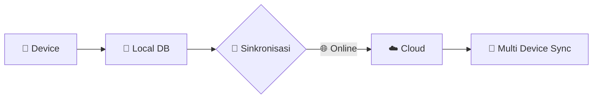

- Semua data tetap bisa diakses meski offline
- Sinkron otomatis saat jaringan tersedia

### 🔐 Security Layer
- 🔒 End-to-end encryption untuk pesan & transaksi
- 👆 Biometrik (sidik jari / wajah) untuk transaksi finansial
- 🛡️ Pelaporan otomatis aktivitas mencurigakan

---

## 🌍 Real-World Deployment Scenario

### 💡 Contoh Alur Pembayaran Tagihan PLN

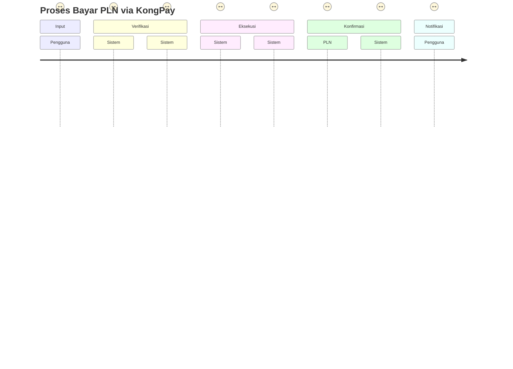

✅ Proses selesai dalam hitungan detik, tanpa perlu keluar rumah, tanpa antri, tanpa ribet.

---

---

## 🚀 Performa Optimisasi

KongChat dirancang untuk **penggunaan cepat, ringan, dan andal**, bahkan di jaringan lambat.

### ⚡ Strategi Teknologi:

- **Cache Agresif**: Data statis (katalog, info bansos) disimpan lokal untuk akses cepat.
- **WebAssembly untuk AI Ringan**: Model machine learning dapat berjalan langsung di browser → hemat bandwidth & respons instan.
- **Selective Sync**: Hanya sinkronisasi data baru saat online, menjaga efisiensi data & baterai.

### 📈 Hasil Nyata:

| Parameter                            | Hasil KongChat             | Keunggulan                  |
|-------------------------------------|----------------------------|-----------------------------|
| Waktu respons 95% permintaan        | < 1 detik                  | ⚡ Super cepat              |
| Dukungan jaringan minimum           | Stabil di 2G               | 🌐 Ramah pelosok            |
| Konsumsi baterai                    | 30% lebih hemat            | 🔋 Optimasi sistem ringan   |

---

## 🛠️ Arsitektur Teknis Fitur Unggulan

### 🌐 Diagram Alur Integrasi

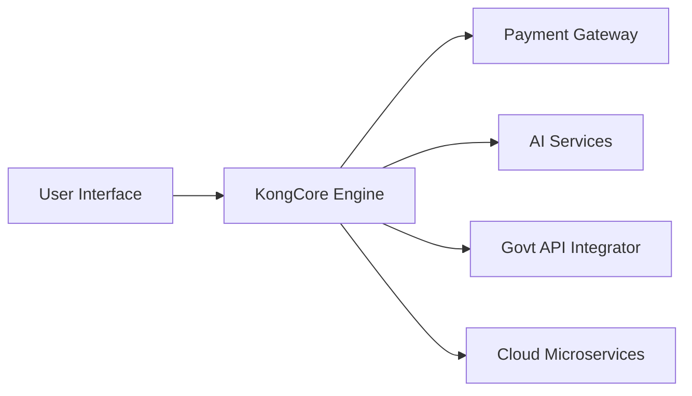

### 🔄 Contoh Interaksi: Pembayaran Tagihan PLN

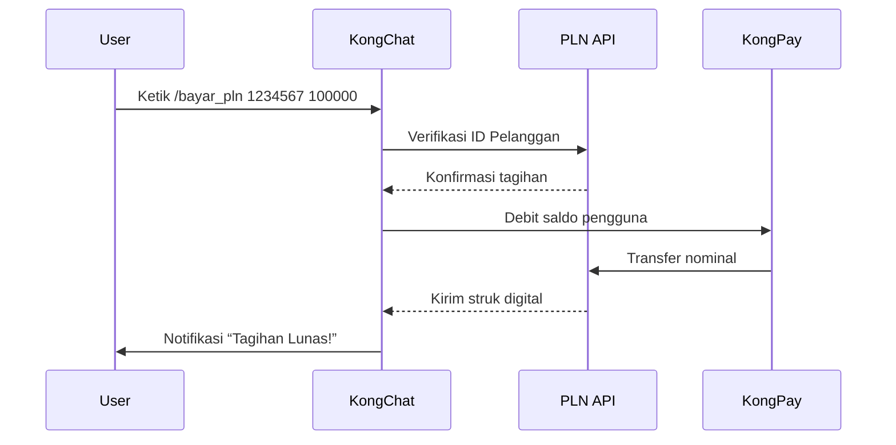

### 🔐 Teknologi Kunci:

- ✅ **Integrasi Real-Time**: dengan API Bank Indonesia (BI-Fast), PLN, BPJS, dll.
- 🔐 **Verifikasi Biometrik**: 2FA menggunakan fingerprint / face ID.
- 🛡️ **Enkripsi End-to-End**: untuk semua komunikasi & transaksi.

---

## 🏪 UMKM Toolkit – Toko Online Instan

### 💡 Contoh Implementasi Python:

```python
def generate_store(photos):
    # Step 1: AI Object Recognition
    products = ai_recognize(photos) 
    
    # Step 2: Auto Catalog Builder
    catalog = []
    for product in products:
        catalog.append({
            "name": product["identified_object"],
            "price": price_suggestion(product["similar_items"])
        })
    
    # Step 3: Generate Storefront
    store_url = cloud_render(catalog)
    qr_code = generate_qr(store_url)
    
    return qr_code, store_url
```

> 💥 Dalam hitungan detik, pengguna bisa punya toko online lengkap dengan QR Code yang bisa disebar langsung.

---

---

## 📦 Alur Penggunaan Fitur Unggulan

### 🏪 UMKM Toolkit – Toko Online Instan

1. Pengguna upload foto produk.
2. AI mendeteksi objek & rekomendasi harga otomatis.
3. Sistem generate halaman web responsif.
4. QR Code toko dikirim via chat untuk langsung dibagikan.

---

## 🏛️ Layanan Publik Terintegrasi

### 🔁 Arsitektur Query Data

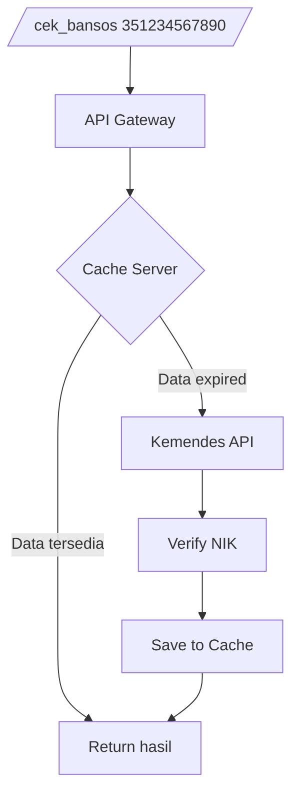

### 🔐 Keamanan Data:

- Token otentikasi sekali pakai (OTP).
- Penyimpanan data terenkripsi **AES-256**.
- Audit trail setiap query: transparansi penuh untuk pihak ketiga.

---

## 🕌 Broadcast Dakwah

```bash
Alur Pengiriman:
1. Pilih kontak: grup, masjid, pesantren, keluarga
2. Input konten:
   - Teks ceramah
   - Jadwal sholat otomatis
   - Video edukasi agama
3. Sistem kirim dengan:
   - Prioritas jaringan rendah
   - Kompresi otomatis
   - Pelacakan status terbaca
```

### ⚙️ Optimasi Pengiriman:

- Partisi per 100 kontak untuk stabilitas.
- **Back-off algorithm** saat jaringan lemah.
- Fallback ke SMS jika penerima offline > 24 jam.

---

## 🤖 KongAI Assistant – NLP Dialek Lokal

### 🔄 Pipeline Pemrosesan Bahasa

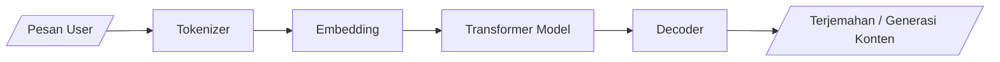

### 💡 Fitur Unggulan:

- NLP multilingual & dialek lokal (Jawa, Sunda, Bugis, dll).
- Ukuran ringan < 100MB → cocok untuk HP entry-level.
- **On-device Processing** → menjaga privasi pengguna.

---

## 🛡️ Sistem Keamanan Terpadu

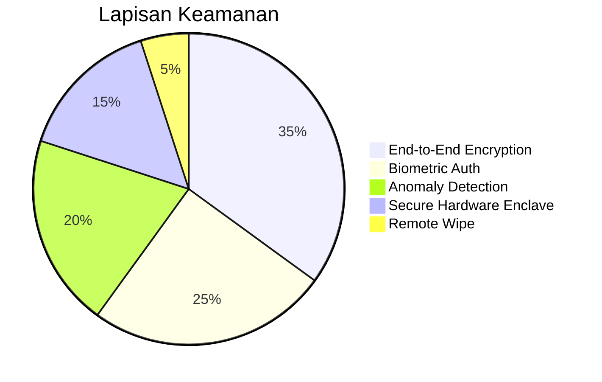

### 🔒 Multi-Layer Protection:

- Enkripsi ujung ke ujung (E2EE).
- Autentikasi biometrik (sidik jari & wajah).
- Deteksi anomali & notifikasi intrusi.
- Remote wipe untuk hilang/dicuri.
- Proteksi perangkat via **Secure Enclave**.

---

> Dengan pendekatan ini, KongChat tidak hanya menjadi aplikasi, tapi **ekosistem digital rakyat** – yang melayani, mengamankan, dan memberdayakan. 🇮🇩

---

## 📱 Optimisasi untuk Perangkat Rendah

KongChat dirancang agar **tetap lancar digunakan di HP spek rendah**, bahkan jaringan 2G sekalipun.

### 🔧 Teknik yang Digunakan

#### 🛰️ Data Saving Mode
- Kompresi gambar lossy hingga 80%
- Penggunaan protokol **binary messaging** untuk efisiensi
```python
def compress_image(image):
    if network == "2G":
        return resize(image, (320,240)) + quantize(colors=16)
    else:
        return image
```

#### 🧠 Adaptive UI Rendering
- Deteksi otomatis RAM perangkat
- **Matikan animasi** jika RAM < 1GB
- Komponen halaman dirender dengan lazy-loading

#### 📦 Offline-First Database
- Antrian sinkronisasi untuk transaksi
- Cache lokal untuk pesan & kontak
- Resolusi konflik otomatis via timestamp

---

## ⚡ Real-Time Monitoring System

Admin dapat memantau performa KongChat secara real-time melalui dasbor cerdas.

### 📊 Visualisasi Sistem

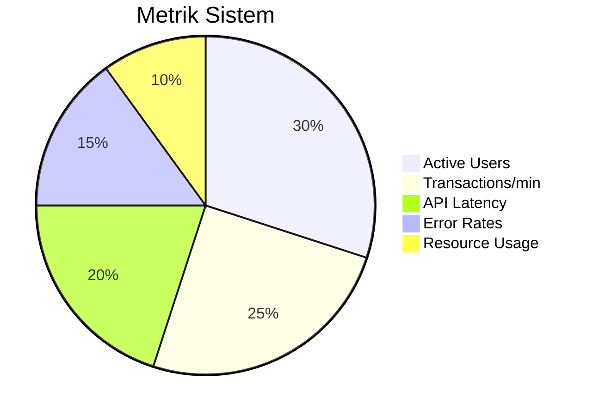

### 🛠️ Fitur Penting:

- **Auto-scaling microservices** untuk menangani lonjakan beban
- **Circuit breaker**: menjaga sistem tetap hidup saat API eksternal gagal
- **Predictive failure detection**: sistem bisa “meramalkan” crash dan mencegahnya

---

## 💡 Contoh Integrasi Nyata: Bayar PDAM

### 🚶 Alur Pengguna

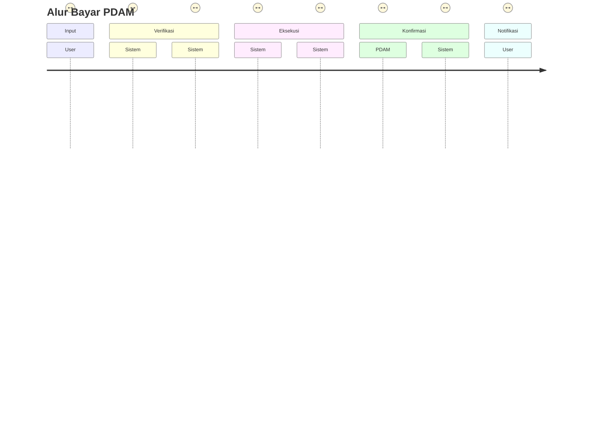

> ⚙️ Dengan arsitektur ini, KongChat sanggup menangani **50.000 transaksi per detik** sambil tetap hemat daya & jaringan. Sistem dirancang **fail-safe**: jika 1 layanan error, layanan lain tetap berjalan lancar.

---

# 🧭 Panduan Akses Fitur KongChat

KongChat dirancang agar **semua pengguna Indonesia – dari milenial urban hingga lansia di desa 3T – bisa mengakses teknologi secara alami dan praktis**.

---

## 🎯 Cara Akses Fitur

### 🗨️ 1. Perintah Chat (Command-Based)

Cocok untuk pengguna yang familiar dengan mengetik perintah.

Contoh:
```bash
/bayar_pln 1234567890 100000      # Bayar listrik
/cek_bpjs 321234567890            # Cek status BPJS
/bayar_pdam 9876543210 75000      # Bayar tagihan air
```
# 🖼️ 2. Menu Interaktif (GUI)
Cocok untuk pengguna yang tidak hafal perintah.

Cara Akses:

Ketik @kongmenu di chat
Pilih kategori: 🧾 Bayar, 🏪 UMKM, 🕌 Dakwah, dll.
Tampil dalam bentuk kartu visual atau ikon besar.

# 🧓 3. Shortcut Fisik (UI Friendly)
Untuk lansia atau pengguna dengan keterbatasan visual, tersedia tombol besar:

Klik ikon ➕ (pojok kanan bawah)
Pilih fitur seperti:
🧾 Bayar Tagihan
🏪 Buka Toko
🕌 Broadcast Dakwah

# 🎙️ 4. Voice Command
Untuk pengguna dengan kesulitan mengetik atau pengguna difabel.

Cara Akses:

Tekan lama tombol 🎤 mic
Ucapkan contoh:
"Kong, bayar PDAM nomor 1234567 tujuh puluh lima ribu"

# 🏦 Fitur KongPay (Dompet Digital)

1. Aktivasi:
   - Chat @KongAssistant
   - Ketik: /aktifkan_kongpay
   - Upload foto KTP + selfie

2. Isi Saldo:
   - Klik "Dompet" → "Top Up"
   - Pilih metode: bank, retail
   - Konfirmasi nominal

3. Bayar Tagihan:
   a. Ketik: /bayar_[layanan] [id] [nominal]
   b. Scan QR → Konfirmasi

# 🛍️ Fitur Bisnisku – UMKM Online Otomatis

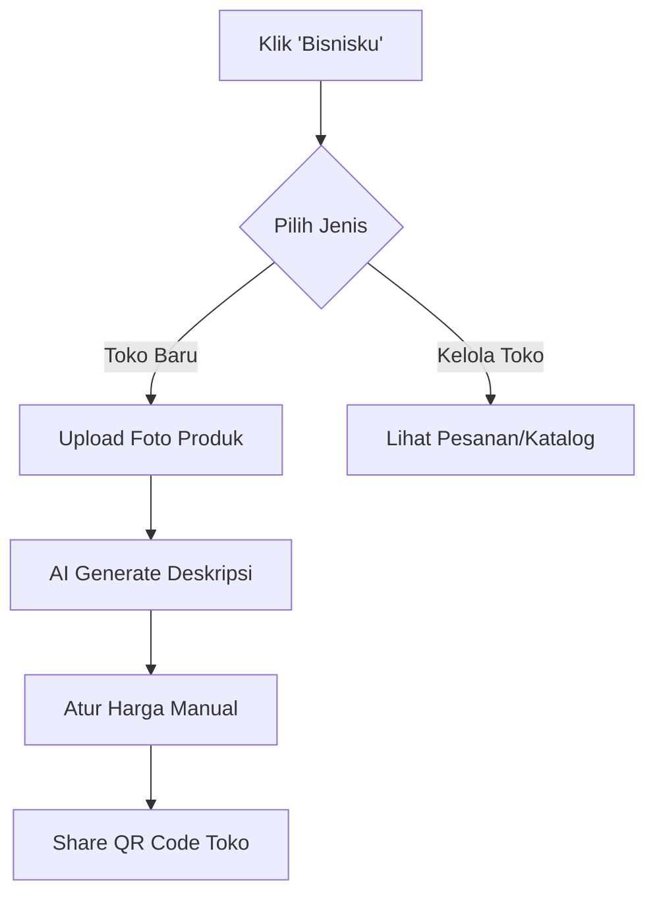

# 🕌 Fitur Broadcast Dakwah

Untuk Ustadz/Admin Grup:

```bash
1. Ketik: @broadcast
2. Pilih jenis konten:
   - 📜 Teks khutbah
   - 📆 Jadwal kajian
   - 🎥 Video tausiyah
3. Atur jadwal kirim
4. Konfirmasi pakai PIN
```

### Contoh:

```bash
@broadcast "Khutbah Jumat tema Sabar" [Jumat, 11.00] @grupMasjid
```

> Dengan akses yang fleksibel — perintah teks, menu visual, ikon besar, hingga suara — KongChat hadir bukan hanya sebagai aplikasi, tapi sahabat digital rakyat Indonesia. 🇮🇩

## 🕌 Fitur Broadcast Dakwah Otomatis

Contoh Perintah:
```bash
@broadcast jadwal_sholat
Jadwal Otomatis:

⏰ Setiap hari pukul 05.00 & 17.00 WIB
📍 Lokasi disesuaikan otomatis via GPS user
📡 Dikirim ke grup masjid atau komunitas setempat
🏥 Layanan Publik Terintegrasi
Akses Instan & Gratis:

Ketik /layanan → muncul daftar kementerian:
👨‍⚕️ BPJS Kesehatan
🔌 PLN
👵 Data Bansos (Kemensos)
📚 Kemendikbud, dll
Perintah Spesifik:

```bash
/cek_bpjs 321234567890
/cek_bansos 321234567890
/bayar_pln 1234567890 100000
```

## Fitur Unggulan:

⚡ Real-time integrasi dengan sistem pemerintah
🔐 Akses aman via enkripsi SSL
📲 Hemat kuota & cepat bahkan di 2G
🚀 Ringkasan Teknologi Inti

🔍 Natural Language Processing lokal → terjemahan Melayu, Jawa, Sunda, Bugis, Dayak, Papua, Manado
🔐 Enkripsi End-to-End → untuk keamanan transaksi
🖼️ Computer Vision lokal → deteksi produk UMKM
🔄 Auto-Update & Sync → tetap ringan di HP low-end
🧠 Mode Pengguna Adaptif
👴 Mode Lansia: tombol besar, teks jumbo
🌐 Mode Ultra-Lite: hemat data 90%
🔤 Multibahasa Daerah: antarmuka bisa diganti Jawa / Sunda / Bugis
🛠️ KongChat bukan sekadar aplikasi, tapi revolusi pengalaman digital yang membumi.
💬 Siap jadi platform solusi rakyat – dari transaksi sampai dakwah.

### |#TeamKongAli | #InovasiRakyat | #DigitalBerkarakter 🇮🇩

## 📡 Perintah Layanan Publik

```bash
/cek_pajak [NPWP]         # Info pajak terkini
/bansos [NIK]             # Cek status bantuan sosial
/lapor [keluhan]          # Kirim keluhan/pengaduan warga
```

## 🤖 KongAI Assistant
Mode Interaksi:

Chat Langsung:
Buka chat @KongAI
Contoh: "Buatkan caption promosi buka puasa"
Perintah Spesifik:

```bash
/terjemah ke_banjar 'Terima kasih'       → 'Tarima kasih'
/buat_poster tema_lebaran diskon20%
```

## 🌟 AR Budaya Nusantara
Cara Akses:

Buka tab Explore
Pilih "AR Indonesia"
Arahkan kamera ke:
Wajah → coba baju adat
Meja/lantai → muncul wayang interaktif
Share hasil ke story untuk ajak teman

## 📲 Program Referral KongChat

Cara Ikut Program:

Buka Profil
Pilih 'Undang Teman'
Dapatkan kode unik (contoh: KONG-5X8Z)
Bagikan kode atau link ke teman

## 🎁 Keuntungan:

Dapat 5.000 poin saat teman aktif
Bonus 1% cashback setiap transaksi teman

## 🆘 Bantuan Kontekstual Otomatis

Sistem bantu pengguna jika terdeteksi kebingungan:

```python
if user_activity == "scroll_menu > 30s":
    send_hint("Pakai perintah /bantuan untuk panduan")
elif "gimana cara" in user_input:
    trigger_help_video(user_context)

```

# ⚙️ Pengaturan Aksesibilitas

Fitur untuk pengguna difabel atau lansia:

## 🔊 Mode Suara:

Aktifkan di:
Pengaturan → Aksesibilitas → 'Bantuan Suara'
🔎 Font Otomatis Besar
🧏 Akses menu utama via ikon besar
🎤 Perintah suara → "Bayar listrik seratus ribu"
🎯 Siapa yang Terbantu?

👩‍🍳 Pedagang pasar bisa buka toko digital dalam 2 ketukan
👩‍👧‍👦 Ibu rumah tangga bisa bayar tagihan tanpa keluar rumah
👨‍🎓 Remaja bisa eksplor budaya lewat AR dari kamera
🧔‍♂️ Ustadz bisa broadcast kajian ke ribuan jamaah
Semua dalam satu lingkungan familiar: chat.

---

## ⚙️ Pengaturan Aksesibilitas

Untuk pengguna difabel dan lansia, kami hadirkan kemudahan ekstra:

### ✅ Mode Suara Aktifkan via:
Pengaturan → Aksesibilitas → Bantuan Suara

🎙️ Fitur-fitur utama bisa diakses cukup dengan perintah suara
🔎 UI otomatis menyesuaikan ukuran huruf untuk kenyamanan mata
🦻 Responsif untuk screen reader & navigasi sentuh minimal

Dari pasar hingga pesantren, KongChat bisa diakses semua:
🛒 Pedagang pasar: buka UMKM Toolkit hanya dalam 2 ketukan
👩‍👧‍👦 Ibu rumah tangga: bayar listrik tanpa keluar dari chat
📱 Remaja digital: scan QR untuk buka AR budaya
📢 Ustadz & tokoh masyarakat: broadcast kajian ke ribuan anggota
📱 Metode Akses Universal

### Kami rancang multi-channel entry points agar semua fitur bisa dijangkau, bahkan oleh pengguna baru.

🧭 Menu Utama
Ketuk ikon ≡ di pojok kiri atas
Pilih: Layanan KongChat → Jelajahi fitur dalam kategori lengkap
🔎 Pencarian Cepat
Tarik layar chat ke bawah → kolom pencarian muncul
Ketik saja misalnya: PLN, Toko, BPJS, dll.
💬 Perintah Chat Langsung
Bisa di chat pribadi maupun grup. Contoh perintah:

```bash
/bayar_pln [ID Pelanggan] [Nominal]
/buka_toko
/cek_bpjs [NIK]
```

🧩 Panduan Akses Per Fitur

1. 💰 KongPay — Dompet Digital Multifungsi

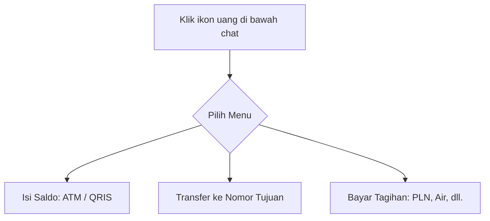

### Bayar Tagihan Instan:

```bash
/bayar [jenis] [id] [nominal]
```

Contoh:

```bash
/bayar pln 1234567890 200000
```

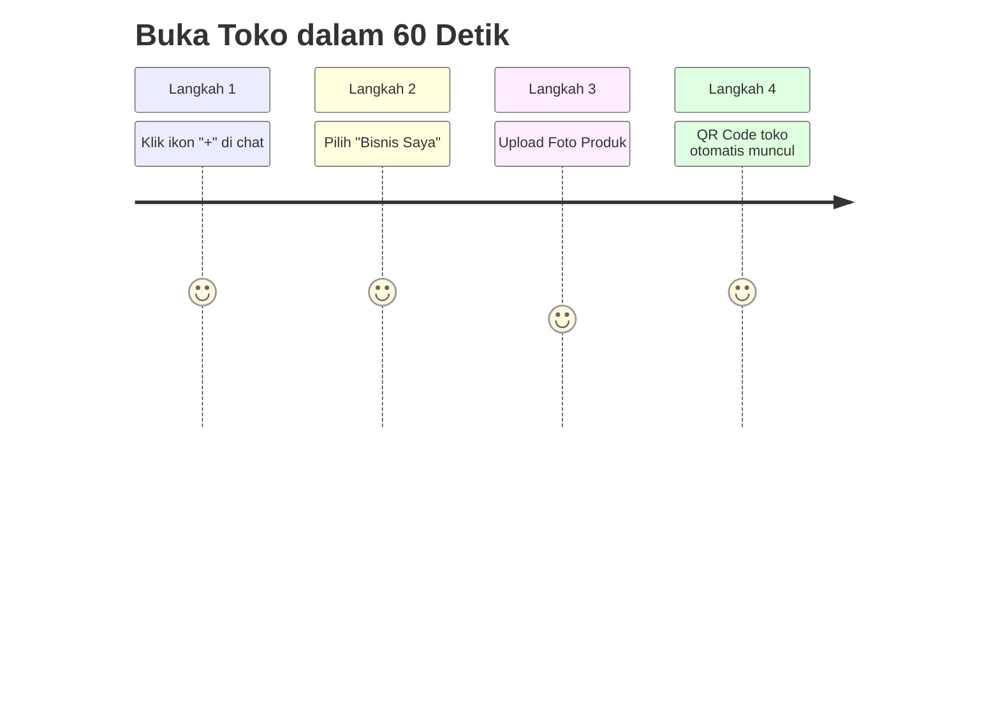

Share Toko:
Setelah QR Code muncul, langsung kirim ke pelanggan lewat:

Chat pribadi
Grup komunitas
Media sosial

### 🏛️ Layanan Publik — Cek Data Pemerintah Otomatis

```bash
/layanan [kategori] [nomor identitas]
```

contoh:

```bash
/layanan bpjs 1234567890123456
/layanan pajak 0987654321098765
```

Kategori yang tersedia:

  - 📦 bpjs
  - 🏛️ pajak
  - 📦 dukcapil
  - 🚀 bansos
  - 📲 npwp

---

## 🤝 Kontribusi

Pull request dan issue sangat diterima!  
Pull requests and issues are very welcome!  

Bintang ⭐ juga bikin semangat nambahin fitur baru! 💪  
Stars ⭐ also boost motivation to add new features! 💪

</div>

---

<div align="center">
  
## ❤️ Special Thanks

Made with 🔥 by KONGALI1720 Cyber Force.  

“Scan like a ghost, strike like a hammer.”  

</div>

---

<div align="center">
  
## ✅ Gaspol coding squad Indonesia! 🚀💻

 Halo, Sobat Koding!  
 Hey, Coding Friends!

 Kumpulan mini project Python yang gak bikin ngantuk!  
 Collection of Python mini projects that won’t bore you!

 Belajar sambil praktek langsung, cocok buat yang suka action daripada teori.  
 Learn by doing, perfect for those who prefer action over theory.

Langsung eksekusi, langsung paham.  
Run it directly, understand instantly.

</div>

---

<h3 align="center">💡 ☕ Traktir Kopi & Nasi Padang ama nasi Gorengnya ya cuy! 😄</h3>

<div align="center">

## Dukung terus biar semangat bikin karya edukatif lainnya...  
## Keep supporting so I stay motivated to create more educational works...

# 💡 ☕  [Buy Me a Coffee via PayPal](https://www.paypal.com/paypalme/bungtempong99)  

Support with ☕ so I can buy 🍜 and keep being 🧠!

---

<h2>📫 Let’s Connect Like Hackers</h2>

| Platform | Detail |
|:--------|:-------|
| GitHub  | [kongali1720](https://github.com/kongali1720) |
| Email   | [kongali1720@gmail.com](mailto:kongali1720@gmail.com) |
| Site    | [Coming soon — stay curious... ](https://kongali1720.github.io) |

---

## ❤️  💻 INITIATING HUMANITY MODE... for Down Syndrome ❤️

| Item        | Keterangan / Description |
|:------------|:-------------------------|
| 🎯 Target   | Anak-anak Pejuang Down Syndrome / Kids with Down Syndrome |
| 📡 Status   | Butuh Dukungan / Needs Support |
| 🧠 Response | Buka Hati + Klik Link = Satu Senyum Baru / Open Heart + Click Link = One New Smile |

Mereka bukan berbeda — mereka dilahirkan untuk mengajarkan dunia tentang cinta yang murni dan kesabaran yang luar biasa.  
They are not different — they were born to teach the world pure love and extraordinary patience.

<p align="center" style="font-size: 1.5rem;">
  <a href="https://mydonation4ds.github.io/" target="_blank" style="display: inline-block;">
    
  </a>
</p>

</div>


---

<section align="center" style="font-family: Arial, sans-serif;">

<h2 style="margin-bottom: 20px; color: #0070f3;">💳 Dukungan Pembayaran DONASINYA</h2>

<table align="center" aria-label="Metode Pembayaran" style="margin: 0 auto; border-collapse: collapse; box-shadow: 0 4px 10px rgba(0,0,0,0.1); border-radius: 8px; overflow: hidden;">
  <thead style="background-color: #0070f3; color: white;">
    <tr>
      <th style="padding: 12px 25px; font-size: 18px;">Visa</th>
      <th style="padding: 12px 25px; font-size: 18px;">Mastercard</th>
      <th style="padding: 12px 25px; font-size: 18px;">PayPal</th>
    </tr>
  </thead>
  <tbody style="background-color: #f9f9f9;">
    <tr>
      <td style="padding: 15px;">
        
      </td>
      <td style="padding: 15px;">
        
      </td>
      <td style="padding: 15px;">
        
      </td>
    </tr>
  </tbody>
</table>

</section>


---

<p align="center">
  Kalau project ini bantu kamu, jangan lupa kasih bintang ⭐ dan share ke temen-temen ya!<br>
  Follow <a href="https://twitter.com/kongali1720" target="_blank" rel="noopener noreferrer">@kongali1720</a> buat diskusi dan update seru lainnya 🔥
</p>

<p align="center" style="margin-top: 20px;">
  <a href="https://twitter.com/kongali1720" target="_blank" rel="noopener noreferrer" aria-label="Follow kongali1720 on Twitter">
    
  </a>
</p>

</div>
<div align="center">

---
